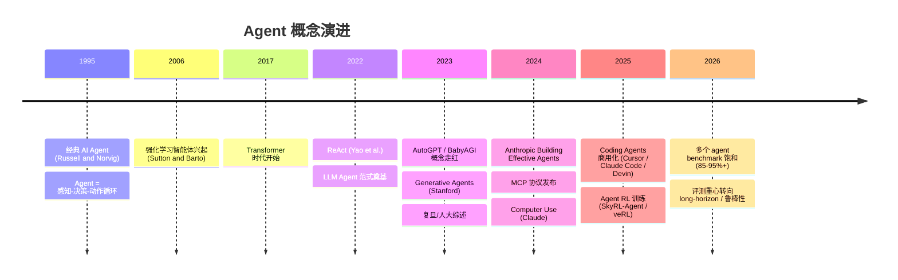
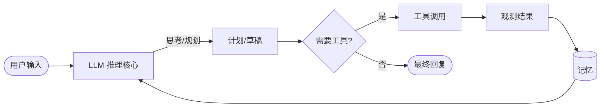

# 01 · Foundations 基础与定义

> 学习目标：能用一句话讲清楚「workflow / agent / 多智能体系统」的边界，并把现代 LLM Agent 嵌入「经典 AI Agent」的历史脉络中。

## 1. 历史脉络：从经典到 LLM 时代

## 2. 关键定义辨析

### 2.1 经典 Agent（Russell and Norvig）

> 一个 *agent* 是任何能通过 *sensors* 感知环境、并通过 *actuators* 在环境中采取行动的实体。

四要素：**PEAS = Performance / Environment / Actuators / Sensors**。
我们今天讨论的 LLM Agent，本质是把 *决策核心* 替换成了 LLM，但 PEAS 框架仍然适用。

### 2.2 LLM Agent

最小定义（本仓库采用）：

> **LLM Agent** = LLM 作为推理核心 + 自主选择工具 + 在循环中持续观察反馈，直到任务完成。

### 2.3 Workflow vs Agent（Anthropic 视角）

Anthropic 在 *Building Effective Agents*（2024）中提出一个关键区分：

| 维度 | Workflow | Agent |
|------|---------|-------|
| 控制流 | **程序员** 显式编排 | **LLM** 动态决定 |
| 工具调用顺序 | 固定 / 条件分支 | 自主选择 |
| 终止条件 | 显式 | LLM 判断或步数上限 |
| 可预测性 | 高 | 中-低 |
| 适用场景 | 任务边界清晰 | 任务开放、步数不可知 |

> **经验法则**：能用 workflow 解决就别用 agent。Agent 引入的不可控成本（token、时延、调试）必须由「足够开放的任务」来 justify。

## 3. 必读论文

| 论文 | 年份 | 一句话精华 |
|------|------|-----------|
| Russell & Norvig, *AIMA* | 1995/2020 | 经典 agent 理论框架，PEAS 与理性 agent。 |
| Xi et al., *The Rise and Potential of LLM Based Agents: A Survey* (Fudan) | 2023 | 全景综述：brain/perception/action 三件套。 |
| Wang et al., *Survey on LLM-based Autonomous Agents* (RUC) | 2023 | 应用-架构-评估三视角综述。 |
| Sumers et al., *Cognitive Architectures for Language Agents (CoALA)* | 2024 | 用认知科学的 working memory / procedural memory 重新组织 agent。 |
| Anthropic, *Building Effective Agents* | 2024 | 工程视角：何时该用 workflow，何时该用 agent。 |

详细笔记位于 [`notes/`](./notes/)。

## 4. 本章 notebook

[`notebooks/min_agent_vs_workflow.ipynb`](./notebooks/min_agent_vs_workflow.ipynb)：
用同一个「查天气 + 给出穿衣建议」任务，先写一个 **workflow** 版本（固定调用顺序），再写一个 **agent** 版本（LLM 自主决定调用顺序），直观感受差异。

## 5. 自检问题

- 你能在不看本页面的情况下，画出 LLM Agent 的内循环吗？
- 「调一次 tool 然后总结」算 agent 吗？为什么？
- 一个固定 5 步的 RAG pipeline 算 workflow 还是 agent？
- 一个组织里哪些任务更适合 workflow？哪些适合 agent？
