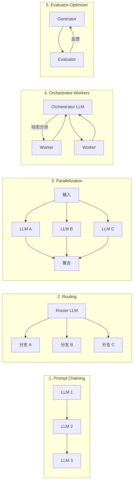

# 笔记 · Anthropic - Building Effective Agents（2024 工程博客）

- 链接：anthropic.com/research/building-effective-agents
- 类型：工程实践博客（非学术论文）

## 核心观点

**优先用 workflow，能 workflow 就别 agent**。

Anthropic 的实战经验是：成功的生产级「agentic 系统」往往不是放飞自由的 agent，而是组合得当的 *workflow*；只在任务边界确实开放、需要 LLM 自主决定步骤时才上 agent。

## 概念区分

| 概念 | 定义 |
|------|------|
| Workflow | 通过预定义代码路径编排 LLM 与工具的系统 |
| Agent | LLM 自主决定使用什么工具、何时停止的系统 |

## 五种 Workflow 模式

## Agent 模式

只有当任务满足以下条件时再考虑：

1. 步数无法预先估计；
2. 需要根据中间观察灵活改变计划；
3. 任务允许偶尔失败/迭代。

Agent 的最小循环：**LLM → 工具调用 → 观测 → LLM …**，直到 LLM 决定停止或达到步数上限。

## 工程要点

- **简单胜于复杂**：很多团队过度抽象（自创框架/DSL），最终调试成本远高于直接写 LLM 调用。
- **可观测性**：必须能 trace 每一步的 prompt / response / 工具入参出参。
- **测试设计**：先小数据集端到端跑通，再扩规模；评测要包含失败模式而非只看 pass rate。
- **人在回路**：高风险动作（写文件、转账等）必须保留 HITL。

## 与本仓库的对应

- 五种 workflow 模式将在第 06 章 / 第 07 章用 LangGraph 各实现一遍。
- HITL / 可观测性 → 第 12 章。
- 何时该上 agent 的判断 → 本章 notebook 用「查天气 + 穿衣建议」做对比。

## 我的批注

- 这篇是 2024 年 agent 浪潮里最务实的一篇。如果时间只够读 1 篇，就读它。
- 与学术综述（如复旦综述）形成对照：一篇关注「能力分类」，一篇关注「该不该用」，互补。
- 落地建议：在你的算法岗工作里，先用「Routing + Orchestrator-Workers」模式覆盖 80% 场景，剩下 20% 再考虑 agent。
