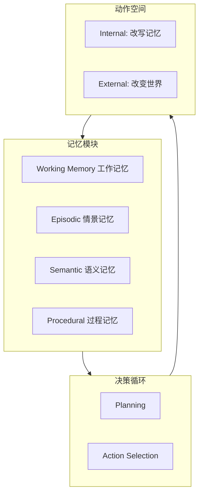

# 笔记 · CoALA: Cognitive Architectures for Language Agents（Sumers et al., 2024）

- arXiv: 2309.02427
- 一句话精华：用认知科学的「记忆/动作/决策」三件套，给 LLM Agent 一个干净的统一框架。

## 核心框架

## 关键贡献

1. **Working Memory 概念**：把 LLM 的 *上下文窗口* 显式建模为「工作记忆」，可被读、写、淘汰。
2. **Internal vs External Action**：Agent 不仅作用于外部世界，也持续修改自身记忆（如 Reflexion 写经验）。
3. **认知架构借鉴**：Soar、ACT-R 等老一代认知架构的 working/long-term memory 区分，对今天的 agent 仍然适用。

## 与其它综述对比

| 维度 | 复旦综述 | 人大综述 | CoALA |
|------|---------|---------|-------|
| 视角 | 分类学 | 应用 + 评估 | 认知科学 |
| 核心抽象 | Brain/Perception/Action | Profile/Memory/Planning/Action | Memory/Decision/Action |
| 适合用途 | 索引拓扑 | 选 baseline | 写代码时的抽象 |

## 启发

- 在写自己的 agent 框架时，把 *记忆* 显式拆成 working / episodic / semantic / procedural 四类，调试和扩展都更轻松。
- 对应到第 04 章：Naive RAG 主要服务 *semantic*，MemGPT 服务 *episodic*，工作流提示模板服务 *procedural*。
