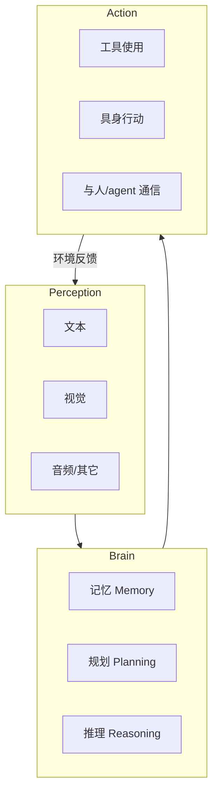

# 笔记 · The Rise and Potential of LLM Based Agents: A Survey（复旦, 2023）

- arXiv: 2309.07864
- 作者：Xi et al.（复旦 NLP 实验室）

## 动机

LLM 本身已具备语言理解能力，但要成为「能改变世界」的 agent，还需要补齐：感知、记忆、规划、工具使用、与环境交互。本文给出一套统一的概念框架，并梳理已有工作。

## 框架：Brain / Perception / Action 三件套

- **Brain**：以 LLM 为核心，承担推理、规划、知识、记忆。
- **Perception**：把多模态外部信号转成 LLM 可处理的表达（文本 token / 视觉 token）。
- **Action**：把 LLM 决策映射为对环境的影响：调用工具、操控机器人、与人对话。

## 关键启发

1. **记忆是 Agent 区别于 LLM 的核心**：单次 prompt 不算 agent，能跨轮维护并利用记忆才算。
2. **规划必须可分解、可回溯**：单步思考往往不够，需要明确的子目标管理。
3. **Action ≠ 只调 API**：与人沟通、与其它 agent 协作也算 action，需要专门设计协议。
4. **应用全景**：本综述列了单 agent / 多 agent / human-agent 三大应用形态，是后续多 agent 章节的索引。

## 与本仓库的对应

- Brain.Memory → 第 04 章。
- Brain.Planning → 第 05 章。
- Action.Tool → 第 03 章。
- 多 agent 形态 → 第 06 章。

## 我的批注

- 框架清晰但偏「分类学」，对*为什么这么设计*交代不多；阅读时建议结合 CoALA（Sumers 2024）用认知科学视角再过一遍。
- 综述写于 2023，缺少 2024-2026 的 MCP / Agent RL 等关键进展。请把本笔记当作入门拓扑，再去补本仓库 03 / 09 / 10 三章。
