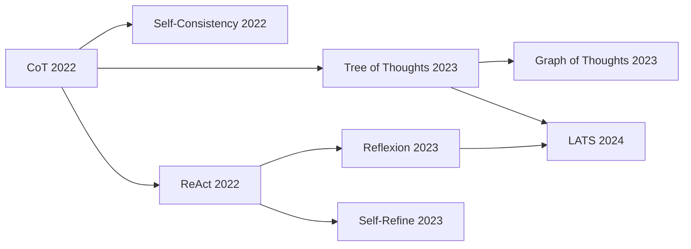

# 02 · Reasoning Patterns 推理范式

> 学习目标：理解从 *单步 CoT* 到 *搜索/反思* 的范式演进，能在面试/工作中给出「任务-范式」匹配建议。

## 范式演进图

## 5 大核心范式速览

| 范式 | 一句话 | 适用 | 代价 |
|------|------|------|------|
| **CoT** (Chain-of-Thought, Wei 2022) | 让模型「先思考再答」 | 推理类问答、数学 | 几乎无额外 |
| **Self-Consistency** (Wang 2022) | 采样多条 CoT，多数投票 | CoT 上加分 | N 倍推理 |
| **ReAct** (Yao 2022) | 思考-行动-观察循环 | 需要外部信息/工具 | 多轮调用 |
| **Reflexion** (Shinn 2023) | 失败后写「教训」回喂 | 多 episode、可重试 | 内存 + 多次尝试 |
| **ToT / LATS** (Yao 2023, Zhou 2024) | 搜索 + 价值评估 | 难解问题、组合搜索 | 大量 LLM 调用 |

## 数学化视角

把所有范式统一看成 **「在思路空间中搜索」**：

\[
\hat y = \arg\max_{y \in \mathcal Y(x)} V(y)
\]

- **CoT**：贪心采样一条 $y$。
- **Self-Consistency**：采样 $N$ 条 $y$，取 majority。
- **ToT/LATS**：以树/图的方式扩展 $\mathcal Y$，用启发式 $V$ 剪枝。
- **ReAct**：把 $y$ 拓展到「文本 + 工具调用 + 观测」交织序列。
- **Reflexion**：在多个 episode 间共享一个 $V$ 的「学习」（自然语言形式）。

## 决策矩阵：到底用哪个？

| 任务特征 | 推荐范式 |
|---------|---------|
| 不需要外部信息，问推理 | CoT 或 Self-Consistency |
| 需要查资料 / 调 API | ReAct |
| 任务可重试，agent 越练越准 | Reflexion |
| 单步成本低、解空间大、有验证器 | ToT / LATS |
| 单步成本高（如调外部 API） | 谨慎搜索，优先 ReAct + 严格 step budget |

## 论文笔记

- [`notes/react.md`](./notes/react.md) — ReAct: Synergizing Reasoning and Acting in LMs (Yao 2022)
- [`notes/reflexion.md`](./notes/reflexion.md) — Reflexion: Verbal RL with Language Agents (Shinn 2023)
- [`notes/tree_of_thoughts.md`](./notes/tree_of_thoughts.md) — Tree of Thoughts (Yao 2023)
- [`notes/lats.md`](./notes/lats.md) — Language Agent Tree Search (Zhou 2024)

## Notebook

[`notebooks/react_from_scratch.ipynb`](./notebooks/react_from_scratch.ipynb)：
从零写 ReAct（含 search + calculator 两个工具），并在 GSM8K 数学题子集上对比 zero-shot CoT vs ReAct vs Self-Consistency 三种范式的准确率与 token。

## 思考题

见 [exercises.md](./exercises.md)。
