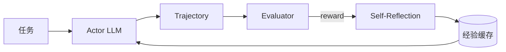

# 笔记 · Reflexion: Language Agents with Verbal Reinforcement Learning（Shinn et al., 2023）

- arXiv: 2303.11366
- NeurIPS 2023
- 一句话精华：把上一次的失败经验写成「自然语言反思」，作为下一次的额外 prompt，相当于 *免梯度* 的 RL。

## 核心循环

三个角色：

- **Actor**：执行任务的 agent（通常是 ReAct）。
- **Evaluator**：判断这次结果好坏（任务规则 / 测试集 / 启发式）。
- **Self-Reflection**：把「失败原因」用自然语言写出来。

下一次 episode：把 *Reflection 文本* 拼到 prompt 里，让 Actor 避免重蹈覆辙。

## 与 RL 的类比

| RL | Reflexion |
|----|----------|
| 梯度更新参数 | 拼接自然语言到 prompt |
| Replay buffer | 反思缓存 (memory) |
| Reward signal | Evaluator 给的 success/fail |

**好处**：完全不需要 fine-tune，零梯度，黑盒模型也能用。
**代价**：能力上限受限于 in-context learning，且 reflection 容易过拟合到具体题目。

## 实验亮点

- 在 HumanEval / WebShop / ALFWorld 上显著超过 ReAct。
- 在 HumanEval 上 GPT-4 + Reflexion 达到 91% pass@1，当时 SOTA。

## 与本仓库

- 是 09 章 *Agent RL* 的「上古祖先」：用语言代替梯度。
- 现代 LATS、CRITIC 等都借了 Reflexion 的思路。

## 评注

- 「verbal RL」这个隐喻很美，但要注意：它本质是 prompt engineering，不是真正的「学习」（参数没变）。
- 工程落地：可以把每次任务失败的「为什么失败」总结成自然语言，喂给下一次的诊断 agent，是一种低成本的提升路径，例如把定位失败 case 的归因传给下游诊断模块。
