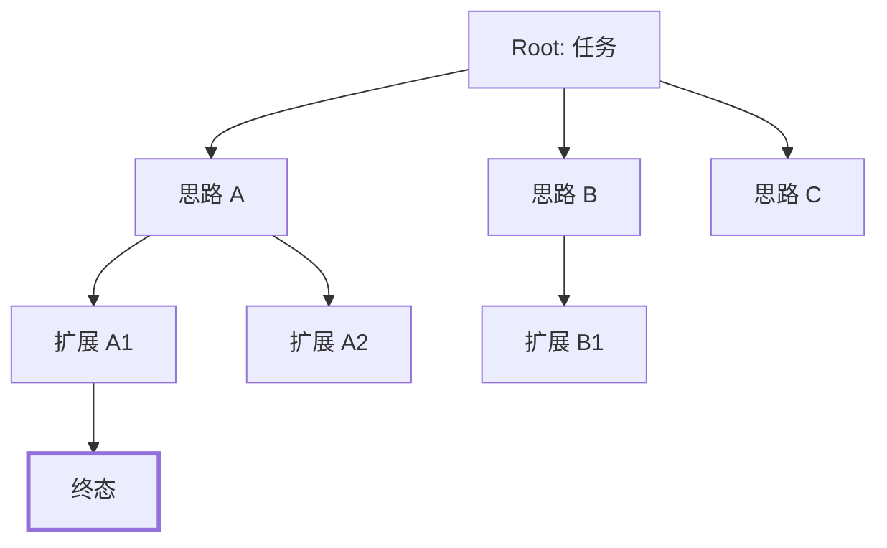
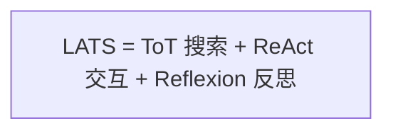

# 笔记 · Tree of Thoughts: Deliberate Problem Solving with LLMs（Yao et al., 2023）

- arXiv: 2305.10601
- NeurIPS 2023
- 一句话精华：把 CoT 的「线性思路」变成「树搜索」，并让 LLM 当 *启发式估值器*。

## 核心思路

四要素：

1. **Thought decomposition**：把问题拆成中间「思路状态」（thought）。
2. **Thought generator**：每个状态生成 $k$ 个候选下一步。
3. **State evaluator**：LLM 给每个候选打分（vote 或 value）。
4. **Search algorithm**：BFS / DFS / Best-first，剪枝。

## 实验亮点

- *24 点游戏*：CoT pass rate 4%，ToT 74%。
- *Creative writing*、*Crosswords* 上也显著领先。

## 局限

- LLM 调用次数爆炸（树展开 + 估值）。
- 适合「单步 LLM 廉价、解空间大、有可验证目标」的任务（如数学、逻辑题），不适合需要外部 IO 的任务。

## 与 ReAct 的关系

ReAct 强调「与外部交互」，ToT 强调「内部搜索」，二者正交：

LATS（下一篇笔记）就是把三者融合的尝试。

## 我的批注

- ToT 在工业界少见——成本极高。但它启发了 *test-time compute* 的整个研究路线（OpenAI o1/o3、DeepSeek-R1）：把树搜索的「思路」内化到模型生成里。
- 你做定位时，路径搜索本身就是 A*/Dijkstra；ToT 的有趣之处是 *用 LLM 当启发函数*，是否可借鉴到「语义+几何混合搜索」？值得思考。
