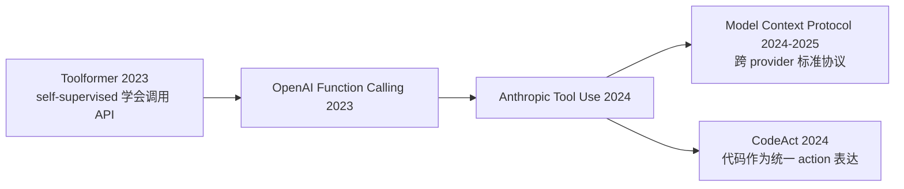
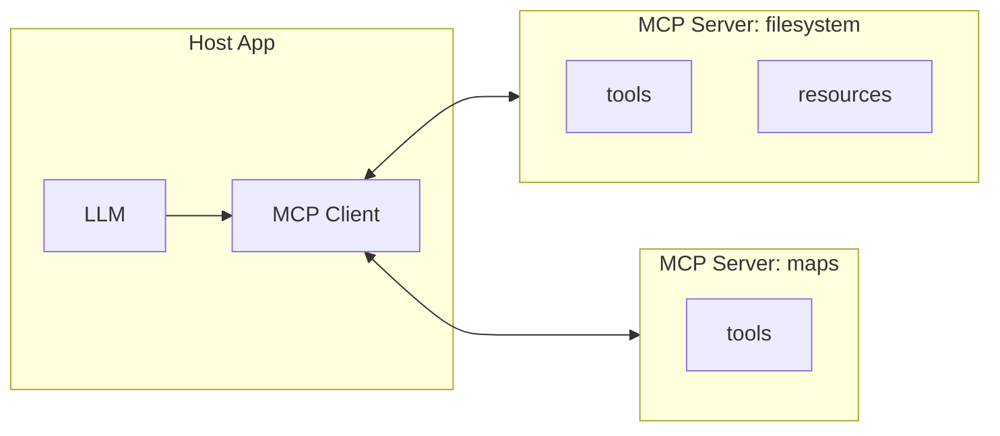

# 03 · Tool Use & MCP 工具使用与协议

> 学习目标：理解从 *Toolformer* 到 *Function Calling* 再到 *MCP* 的协议演进，能独立设计一个工具集合并落到 MCP server。

## 工具使用范式演进

## 三种主流工具调用风格

| 风格 | 代表 | 优点 | 缺点 |
|------|------|------|------|
| **自然语言 ReAct** | ReAct paper | 零依赖、可解释 | 解析脆弱、易幻觉 |
| **JSON Function Calling** | OpenAI / Anthropic | 安全、好集成 | 仍是单回合调用 |
| **代码即动作 (CodeAct)** | CodeAct, Open Interpreter | 表达力强、可组合 | 需要沙箱、安全成本高 |

## MCP（Model Context Protocol）速览

MCP 是 Anthropic 2024 末发布、2025 年成为事实标准的开放协议，旨在为 LLM 提供 *统一* 的：

- **Tools**：可被调用的函数（含 schema）。
- **Resources**：可被读取的内容（文件、URL、数据库片段）。
- **Prompts**：模板化的 prompt 包。

**为什么重要**：

- 一次写好的 MCP Server，可以被 Claude Desktop / Cursor / 各类 agent 框架直接复用。
- 工具生态从「每个框架各自实现」转向「一次写好处处可用」。
- 安全：MCP 的 server-client 架构强制了「能力声明」「权限边界」。

## CodeAct 范式

CodeAct (Wang et al., 2024) 提出：**与其让 LLM 输出 JSON tool_use，不如让它输出可执行 Python**。
理由：

- 多个工具可串接（`a(b(c()))`），表达力远高于一次 tool_use。
- 控制流（for/if/try）天生支持。
- 错误信息（traceback）天生可回喂。

代价：必须有沙箱（Docker / WebAssembly / E2B），否则非常危险。

## 论文笔记

- [`notes/toolformer.md`](./notes/toolformer.md) — Toolformer (Schick 2023)
- [`notes/codeact.md`](./notes/codeact.md) — CodeAct (Wang 2024)
- [`notes/mcp.md`](./notes/mcp.md) — Model Context Protocol 总览

## Notebook 与 Demo

- [`notebooks/multi_tool_agent.ipynb`](./notebooks/multi_tool_agent.ipynb)：用 Anthropic 原生 tool use 构造一个多工具 Agent（计算器 + 时间 + 单位换算），观察 stop_reason 循环。
- [`mcp_demo/`](./mcp_demo/)：一个最小的本地 MCP Server（提供「计算 + 时区查询」工具）和一个 Python 客户端示例，可被 Claude Desktop 或自定义 host 接入。

## 思考题

见 [exercises.md](./exercises.md)。
