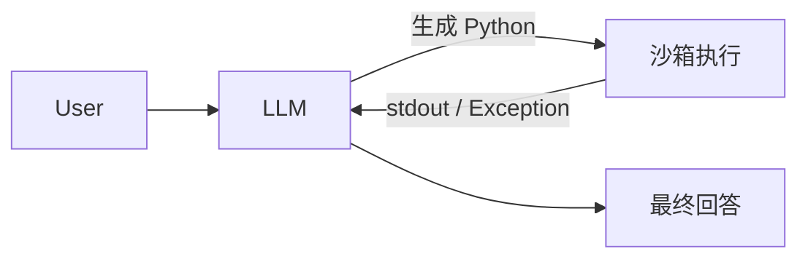

# 笔记 · Executable Code Actions Elicit Better LLM Agents（CodeAct, Wang et al., 2024）

- arXiv: 2402.01030
- ICML 2024
- 一句话精华：把 agent 的 action 表达统一为 *可执行 Python 代码*，比 JSON tool_use 表达力强得多。

## 动机

- JSON Function Calling：每次只能调一个 tool，多步组合靠 LLM 在多轮里串。
- 自然语言 Action：解析脆弱。
- **代码**：天生支持组合（`f(g(h()))`）、控制流、错误处理；并且 LLM 在代码 corpus 上预训练充足，生成稳健。

## 框架

每轮：
1. LLM 输出一段 Python；
2. Sandbox 执行，把 stdout/stderr 当作 observation 回喂；
3. LLM 决定继续写代码还是结束。

## 实验亮点

- 在 API-Bank、ToolBench、M3ToolEval 等多 step 工具调用 benchmark 上，CodeAct 比 JSON 调用平均高 20% 成功率。
- 配套微调 *CodeActAgent*（基于 Mistral / Llama），开源效果不输闭源 GPT-3.5。

## 工程注意

- **沙箱必须**：Docker / E2B / WebContainer / WASM。直接 `exec` 是灾难。
- **状态保持**：通常一个会话维护一个 Python kernel，跨步骤共享变量。
- **错误回喂**：traceback 丢回 LLM，能极大提升修复率。

## 与 MCP 的关系

二者不矛盾，反而互补：
- **MCP** 解决「工具如何被发现 / 调用 / 鉴权」；
- **CodeAct** 解决「单步 action 如何表达更强」。
- 实际系统：用 MCP 暴露工具，让 LLM 在 sandbox 里写 Python 代码并通过 MCP client 调用这些工具。

## 评注

- CodeAct 是「Cursor / Devin / OpenHands」类编码 agent 的精神祖先。
- 工程实践：把传统 pipeline 封装成 *Python API*（如 `pose = relocalize(image, prior)`）后，未来对接 LLM agent 会非常顺滑。
