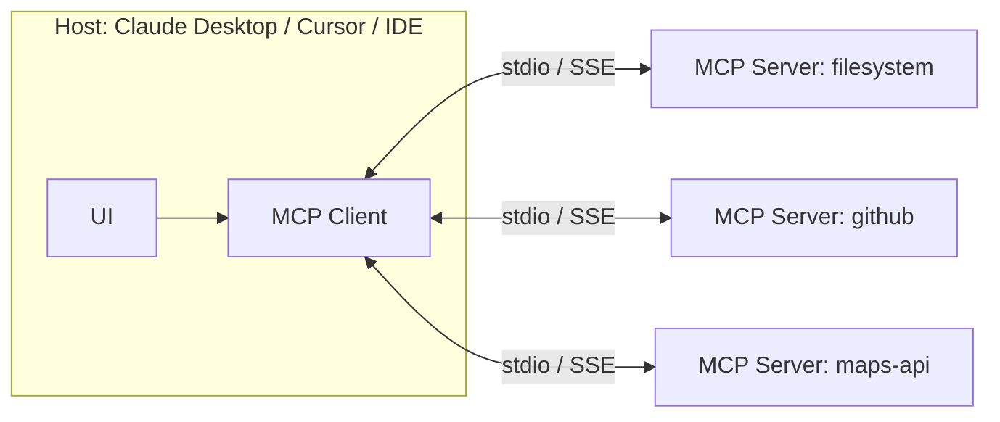

# 笔记 · Model Context Protocol（MCP）总览

- 官方：modelcontextprotocol.io
- 发布：Anthropic 2024-11，2025 起被多家 host 支持（Claude Desktop, Cursor, Windsurf, Continue, Cline, Zed, …）。
- 一句话精华：把「LLM ↔ 工具 / 数据」之间的接口标准化，类似 LSP 之于 IDE。

## 协议三件套

| 概念 | 说明 | 类比 |
|------|------|------|
| **Tools** | LLM 可调用的函数，含 input schema 与说明 | REST API endpoint |
| **Resources** | LLM 可读取的内容（文本、文件、URL） | 文件系统 |
| **Prompts** | 模板化 prompt，host 可呈现给用户 | Snippet / 模板 |

## 架构



- **Host**：用户面向的应用（Claude Desktop、IDE）。
- **Client**：内嵌在 host 中，负责连接 N 个 server。
- **Server**：暴露 tools / resources / prompts，通常是独立进程。
- **传输**：默认 stdio（本地进程），也支持 SSE / streamable HTTP（远程）。

## 为什么这件事重要

1. **复用**：一次写好的 server 在所有 MCP host 中可用。
2. **解耦**：Host 厂商不必为每个工具写 plugin。
3. **安全**：明确的 capability 声明 + 统一的权限边界。
4. **可组合**：用户可以拼装 server 组合，类似 Linux pipe。

## 常见 server 例子

- `filesystem`：读写本地目录。
- `github`：issue / PR / repo 操作。
- `postgres`：SQL 查询。
- `puppeteer` / `playwright`：浏览器控制。
- `time` / `weather` / `wolfram-alpha`：基础工具。
- 自定义：你完全可以写一个「定位算法 server」暴露 `relocalize`、`map_match` 等接口。

## Python 实现要点（mcp SDK ≥1.0）

```python
from mcp.server import Server
from mcp.server.stdio import stdio_server
from mcp.types import Tool, TextContent

server = Server("my-tools")

@server.list_tools()
async def list_tools():
    return [Tool(name="add", description="加法", inputSchema={
        "type": "object",
        "properties": {"a": {"type": "number"}, "b": {"type": "number"}},
        "required": ["a", "b"],
    })]

@server.call_tool()
async def call_tool(name, args):
    if name == "add":
        return [TextContent(type="text", text=str(args["a"] + args["b"]))]

if __name__ == "__main__":
    import asyncio
    asyncio.run(stdio_server(server.run))
```

完整可运行示例见 [`mcp_demo/`](../mcp_demo/)。

## 安全要点（详见第 12 章）

- *Indirect prompt injection*：MCP server 返回的 resource 文本可能含恶意指令；host/agent 必须做隔离。
- *Tool poisoning*：恶意 server 可以伪造 tool 描述诱导调用。建议只装可信 server。
- *Capability scope*：限制 filesystem server 只能访问指定目录、network server 只能访问 allowlist。

## 我的批注

- MCP 不是「学术意义上的创新」，而是「工程意义上的胜利」：把碎片化的工具接入做成了类似 LSP 的标准。
- 对你的部门：未来很可能内部所有算法 service 都要出一个 MCP server 形态，方便 agent 接入；先熟悉 spec 没错。
