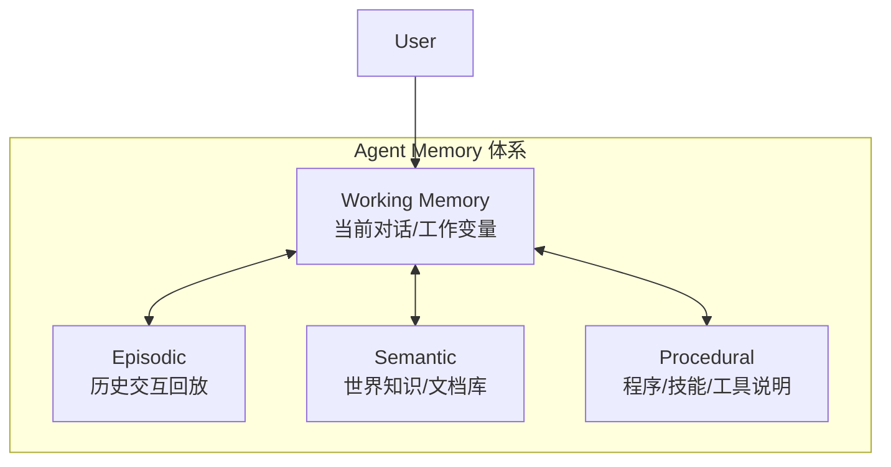
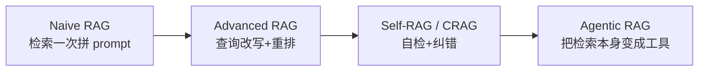

# 04 · Memory & RAG 记忆与检索增强

> 学习目标：把「记忆」从模糊概念拆成可工程化的 4 个层次，把 RAG 从「向量检索 + 拼 prompt」升级到「Agentic RAG」。

## 1. 记忆层次

借用 CoALA（Sumers 2024）的认知架构视角：

| 类型 | 实现方式 | 例子 |
|------|---------|------|
| Working | LLM context window | 当前对话历史 |
| Episodic | 向量数据库 + 时间戳 | Generative Agents 反思流、ChatGPT memory |
| Semantic | 向量库 / 知识图谱 | RAG 文档库 |
| Procedural | Prompt 模板 / few-shot / 工具说明 | system prompt、tool schema |

## 2. RAG 的四代演进

| 代际 | 特征 | 代价 |
|-----|------|-----|
| Naive | 1 次 embedding 查询 + top-k 拼接 | 低 |
| Advanced | 查询改写、HyDE、重排、混合检索（BM25 + dense） | 中 |
| Self-RAG / CRAG | LLM 评估检索结果是否可信，决定是否重检 | 较高 |
| Agentic RAG | 检索是 agent 的一个 tool，可多次、按需调用 | 高，但通用性强 |

## 3. 必读论文

| 论文 | 一句话 |
|------|------|
| Park et al., *Generative Agents* (Stanford 2023) | 反思机制把流水账 episodic memory 升华为可用经验 |
| Packer et al., *MemGPT* (NeurIPS 2024) | 把 OS 的虚拟内存思想搬到 LLM context |
| Asai et al., *Self-RAG* (ICLR 2024) | 让 LLM 自己生成 reflection token 决定何时检索、引用 |
| Yan et al., *Corrective RAG* (CRAG, 2024) | 检索不靠谱时，触发 web 兜底 |
| Wang et al., *A-MEM* (2024-2025) | 让 agent 自组织 memory 节点（zettelkasten 风） |

详细笔记位于 [`notes/`](./notes/)。

## 4. Notebook

[`notebooks/agentic_rag_vs_naive.ipynb`](./notebooks/agentic_rag_vs_naive.ipynb)：
用一个迷你「关于 LLM Agent 的中文知识库」，对比 Naive RAG（一次检索 + 拼 prompt）与 Agentic RAG（agent 自主多次检索 + 自我反思）的命中率与回答质量。

## 5. 业务联想

- 部门海量地图 / POI 数据：哪些适合走 *semantic* 记忆（向量库）？哪些适合 *procedural*（结构化规则）？
- 用户多轮 query（"帮我找一家附近的川菜"→"再要不辣的"）该怎么管 *working memory*？
- *Episodic memory* 在「常用地址 / 通勤偏好」上能做什么？

## 思考题

见 [exercises.md](./exercises.md)。
