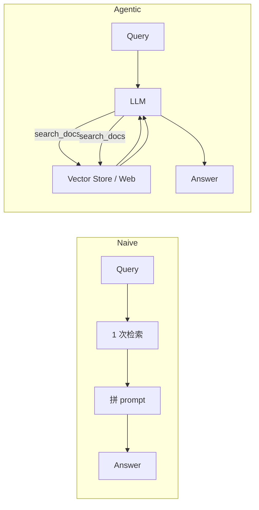

# 笔记 · Agentic RAG（2024-2026）

> Agentic RAG 不是某一篇论文，而是一类范式：**把 retrieval 变成 agent 的工具，让 LLM 自主决定何时、用哪个、查多少次**。

## Naive RAG vs Agentic RAG

## 必要组件

1. **多个 retrieval tool**：本地向量库、BM25、SQL、Web、知识图谱。
2. **查询改写 / 子问题分解**：LLM 拆解复杂问题。
3. **结果汇总 + 引用**：每个证据带来源；最后一次 LLM 整合。
4. **可选 reflection**：质量不够再查。

## 设计模式

| 模式 | 描述 |
|------|------|
| Router-RAG | LLM 决定走哪个 retrieval tool |
| Multi-hop RAG | 一次回答需要多次串联检索（前一步答案是后一步查询） |
| Decomposed RAG | 把 query 拆成 sub-questions，分别检索后聚合 |
| Self-Correct | 检索结果不够好时再查 / 改写 |

## 框架支持

- **LlamaIndex**：原生支持 *RouterQueryEngine*, *SubQuestionQueryEngine*, *Agentic workflows*。
- **LangGraph**：用 Graph 显式编排 retrieval node。
- **DSPy**：用「程序化 prompting」声明式定义 RAG pipeline，配合 optimizer 自动调参。

## 与本仓库 notebook 的对应

`notebooks/agentic_rag_vs_naive.ipynb` 实现：
- Naive RAG：1 次 embedding + top-3 + LLM 拼装。
- Agentic RAG：把 `search_docs(query, k)` 注册为工具，让 LLM 自主调几次、改几次。
- 评测：在故意设计的「需要多跳」与「需要改写」query 上对比命中率。

## 实战经验

- 工业里别一上来就 Agentic：先 Naive，发现 *特定 query 失败模式* 再上 Agentic。
- 为 Agent RAG 准备「retrieval tool 描述」要写清楚 *哪种问题应该问哪种工具*，否则 LLM 乱选。
- 必须做 trace + 评测：Agentic RAG 的失败比 Naive 隐蔽得多。

## 我的批注

- Agentic RAG 是 *RAG → Agent* 的自然延伸；2025 年起几乎所有严肃的 RAG 系统都至少部分 agentic。
- 与定位业务的桥梁：可以把「先查 POI 索引 / 失败再查地图 API / 仍失败转人工」的工作流，建模成 Agentic RAG。
