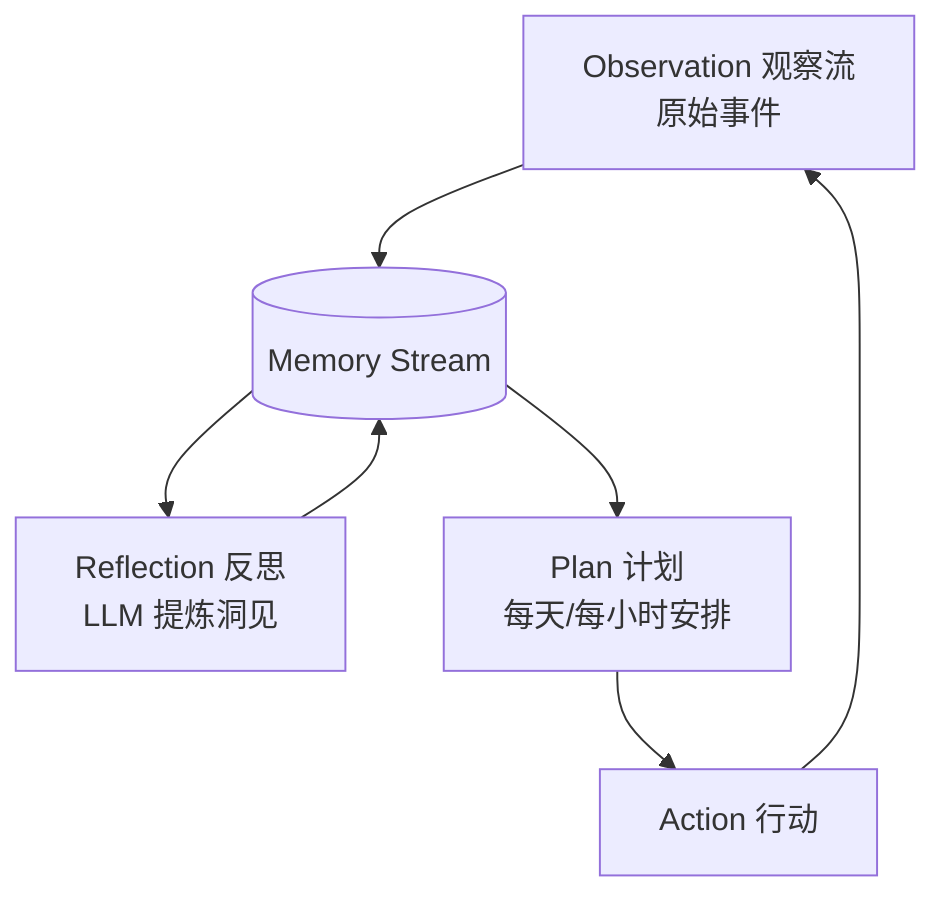

# 笔记 · Generative Agents: Interactive Simulacra of Human Behavior（Park et al., Stanford 2023）

- arXiv: 2304.03442
- UIST 2023 Best Paper
- 一句话精华：用 *观察 → 反思 → 计划* 三层记忆机制，让 25 个 LLM 角色在虚拟小镇里自发涌现社会行为。

## 三层记忆

- **Memory Stream**：所有事件按时间存，每条带 `timestamp / importance / last_access`。
- **检索打分**：`recency × importance × relevance`（embedding 相似度）。
- **Reflection**：定期挑高 importance 事件，让 LLM 写出更高层次的「洞见」。
- **Plan**：把 reflection + 当前状态喂给 LLM，让它生成今天/这小时的计划。

## 关键贡献

- 第一篇把「episodic memory + reflection + planning」组合的 *端到端可玩* demo。
- 涌现：角色之间会自发形成关系、组织聚会，而无需显式编程。
- 给后来 *Voyager*（Minecraft agent）、*Park et al. follow-ups*、*A-MEM* 等提供蓝本。

## 工程要点

- *Importance score*：每条 memory 让 LLM 打 1-10 分，作为 weight。
- *Decay*：`recency = exp(-λ Δt)`，λ 控制遗忘节奏。
- *Reflection trigger*：累计 importance 达阈值就触发，避免每步都反思（成本爆炸）。

## 评注

- 这篇是「让 agent 有人味」的奠基工作，比 ReAct 更接近「agent」的精神（连续性、自我组织）。
- 对工业落地：完全照搬太贵。但 *importance-weighted recency* 这一招可以直接用在 ChatGPT-style 长对话记忆系统里。
- 业务启发：「驾驶/出行助手」之类需要连续上下文的产品，这套机制比单纯 RAG 更合适。
