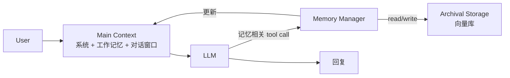

# 笔记 · MemGPT: Towards LLMs as Operating Systems（Packer et al., 2023-2024）

- arXiv: 2310.08560
- 一句话精华：把操作系统的「虚拟内存 / 分页 / 中断」类比搬到 LLM 上下文管理。

## 类比

| OS | MemGPT |
|----|--------|
| 物理 RAM | LLM 上下文窗口（有限） |
| 磁盘 | 外部存储（向量库 / 数据库） |
| 缺页中断 | LLM 调用 `recall` 工具去外部找 |
| 进程切换 | 多任务 / 多用户 session |

## 框架

提供给 LLM 的「内存管理」工具：

- `core_memory_append/replace`：修改 *常驻* working memory（如用户画像）。
- `archival_memory_insert/search`：向 *长期归档* 写入或查询。
- `conversation_search`：检索历史对话。

## 关键贡献

1. 在 LLM 之外，*显式*建一个 memory state machine，由 LLM 自主调用工具维护。
2. 在长对话、文档问答 benchmark 上，相比 truncation / Naive RAG 显著领先。
3. 提供了开源框架（后续演化为 Letta，<https://letta.com>）。

## 工程要点

- *Self-editing* 必然带来不一致：必须有 schema 约束 + 失败回滚。
- *Recall* 命中率高度依赖 embedding 模型与 chunking 策略，不要把责任全推给 LLM。
- *主动总结*：定期让 LLM 把过期对话压缩成 summary 写进 archival，否则上下文还是会爆。

## 与 Generative Agents 的对比

| 维度 | Generative Agents | MemGPT |
|------|-------------------|--------|
| 目的 | 角色拟真 | 通用记忆扩展 |
| 触发 | 周期性 reflection | LLM 自调工具 |
| 抽象 | 心理学 | 计算机系统 |

二者互补：Generative Agents 提供「有什么记忆」的语义模型，MemGPT 提供「怎么管」的工程模型。

## 我的批注

- 把 LLM 当 OS 是个好类比，但记得 *OS 是被人精心设计的*，让 LLM 自己当 OS kernel 风险很大；现实中往往要约束工具集合、限制写权限。
- 对你的工作：如果要做「常驻用户偏好」，MemGPT 的 `core_memory` 设计可直接借鉴。
