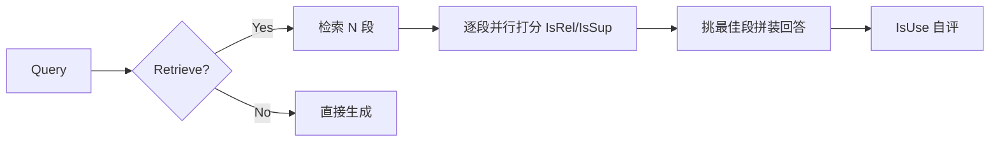
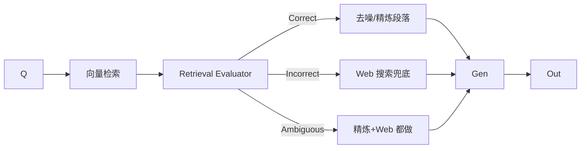

# 笔记 · Self-RAG 与 Corrective RAG（CRAG）

## Self-RAG (Asai et al., ICLR 2024, arXiv 2310.11511)

### 核心思想

让 LLM 在生成时自主插入 *reflection token*，决定：

- `[Retrieve]`：是否需要去检索；
- `[IsRel]`：检索到的段落与 query 相关吗；
- `[IsSup]`：生成的句子是否被段落支持；
- `[IsUse]`：整体回答有用吗。

### 训练方法

通过 *critic LLM* 对训练数据自动加 reflection token，再 fine-tune 一个能输出这些 token 的小模型；推理时无需额外 critic。

### 优势 / 局限

- 优势：每个 query 的检索成本动态调整，引用准确度高。
- 局限：依赖一次 fine-tune；对闭源 API 模型不适用，工业落地多用 prompt-based 模拟。

## Corrective RAG (CRAG, Yan et al., 2024, arXiv 2401.15884)

### 核心思想

在 Naive RAG 基础上加 *Retrieval Evaluator*，把检索结果分成 `Correct / Ambiguous / Incorrect`：

### 关键工程点

- *Knowledge Strip*：把段落进一步切成知识条目，过滤无关。
- *Web Search Fallback*：当本地 KB 不足时，自动转 web；这是把「检索」变 *agentic* 的重要一步。
- 实验：在 PopQA、Bio、PubHealth 上明显超过 Naive RAG / Self-RAG。

## 二者对比

| 维度 | Self-RAG | CRAG |
|------|----------|------|
| 核心机制 | 生成期 reflection token | 检索后 evaluator 评分 |
| 是否需要 fine-tune | 是 | 否（evaluator 是小模型可独立训练或 prompt） |
| 失败兜底 | 重检索 | Web 搜索 |
| 与 Agentic RAG 的距离 | 中 | 近（已经有外部行动） |

## 评注

- 在 *闭源 API* 场景，CRAG 思路更易落地（不依赖 fine-tune）。
- 二者都强调 *评估检索质量*，这是从 Naive RAG → Agentic RAG 的关键中间形态。
- 业务联想：地图 POI 检索同样可以套这个思路——「先查本地索引，置信度低就去线上 API 兜底」。
