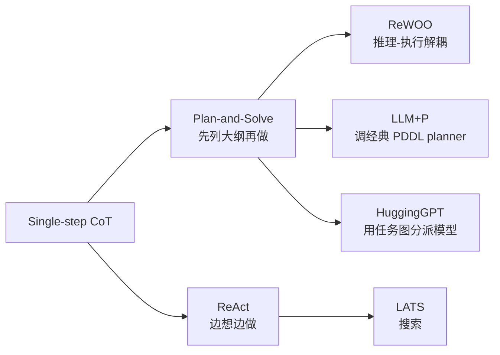
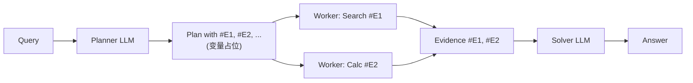

# 05 · Planning 规划

> 学习目标：理解 LLM 与「经典 AI 规划」的接口，掌握 *推理-执行解耦* 思路（ReWOO），能用层次化方法处理长程任务。

## 1. 三大规划范式

## 2. 关键论文

| 论文 | 一句话 |
|------|------|
| Wang et al., *Plan-and-Solve Prompting* (2023) | 先让 LLM 写大纲，再分步执行，比 zero-shot CoT 强 |
| **Liu et al., *LLM+P*** (2023) | LLM 把自然语言转 PDDL，交给经典 planner，再翻回来 |
| **Xu et al., *ReWOO*** (2023) | Reasoning Without Observation：先生成完整计划再执行，省 token |
| **Shen et al., *HuggingGPT*** (NeurIPS 2023) | LLM 当 task router，把子任务分派给 HuggingFace 模型 |
| Yao et al., *ReAct* (2022) | 边想边做（已在 02 章覆盖） |
| Zhou et al., *LATS* (2024) | 搜索式规划（已在 02 章覆盖） |

## 3. 范式对比

| 维度 | ReAct | Plan-and-Solve | ReWOO | LLM+P |
|------|-------|---------------|-------|-------|
| 是否预先规划 | 否 | 是（大纲） | 是（含变量占位的完整 plan） | 是（PDDL plan） |
| 工具调用次数 | 多 LLM round | 多 round | 1 次主 LLM + N 次 worker | 0/少 LLM |
| Token 成本 | 高 | 中 | 低 | 极低 |
| 灵活性 | 高 | 中 | 中 | 低（需 PDDL 域） |
| 适合 | 开放任务 | 中等任务 | 步骤可前置规划 | 形式化可验证 |

## 4. ReWOO 简介（本章重点 notebook）

亮点：
- **Planner** 一次性生成所有 step（含未知量占位）；
- **Workers** 并行/独立执行，结果填回占位；
- **Solver** 一次合成最终答案。
- 相比 ReAct，省去了「每步都让大 LLM 看全历史」的成本。

## 5. Notebook

[`notebooks/rewoo_vs_react.ipynb`](./notebooks/rewoo_vs_react.ipynb)：在「多跳问答」迷你数据集上复现 ReWOO，并与 ReAct 对比 token 消耗与正确率。

## 6. 与定位/路径规划的类比

| 经典路径规划 | LLM 规划 |
|------------|---------|
| HTN (Hierarchical Task Network) | Plan-and-Solve / ReWOO |
| A* / Dijkstra | LLM + 启发式 / LATS |
| MPC（Model Predictive Control） | ReAct（边走边修计划） |

> 经典定位/导航中的层次规划思想几乎可以一一对应到 LLM agent 的规划范式。

## 思考题

见 [exercises.md](./exercises.md)。
