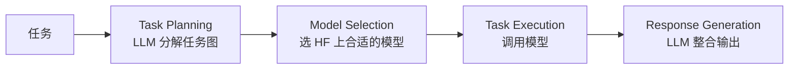

# 笔记 · HuggingGPT: Solving AI Tasks with ChatGPT and its Friends in HuggingFace（Shen et al., 2023）

- arXiv: 2303.17580
- NeurIPS 2023
- 一句话精华：ChatGPT 当任务规划器和模型分派器，HuggingFace 上的成千上万模型当 worker，串成多模态 agent。

## 四阶段



每个 step 节点信息：

```json
{"task": "image-classification", "id": 1, "dep": [-1], "args": {"image": "..."}}
```

`dep` 用于表达任务图依赖（前一步输出作为下一步输入）。

## 关键贡献

- 用 LLM 做 *跨模态* 任务编排：图像、语音、视频、3D 都能拼。
- 形式化「任务图」抽象，是后续 *Agent Workflow*、*MetaGPT* 的雏形。
- 演示了「LLM 是控制平面，专家模型是数据平面」的范式。

## 局限

- 模型选择依赖 HF 模型描述质量。
- 大模型当任务路由器，对小任务有点重；现在更多用 *小路由模型 + LLM verifier* 的组合。

## 与本仓库

- 与第 06 章「多 agent」精神接近，但 HuggingGPT 是「LLM 调用专家模型」，而 06 章 multi-agent 框架是「多个 LLM 互相协作」。
- 与第 11 章地图 agent 精神也接近：把不同的算法服务（POI、路径、定位）想象成 *专家模型*，由 LLM 做编排。

## 我的批注

- HuggingGPT 是「Function Calling + 任务图」的早期具象化；今天若再做，会更倾向于用 MCP 暴露每个模型 API + LangGraph 编排。
