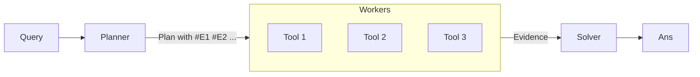

# 笔记 · ReWOO: Decoupling Reasoning from Observations for Efficient Augmented Language Models（Xu et al., 2023）

- arXiv: 2305.18323
- 一句话精华：让 Planner 一次性写出含变量占位的完整 plan，Workers 独立执行，Solver 一次拼装；相比 ReAct 节省 token、降低延迟。

## 三件套



## 例子

Query：*哪个国家是 2022 世界杯冠军，他们国家的人口是多少？*

Planner 输出：

```
Plan: 1. Search the 2022 World Cup champion country.
#E1 = Wikipedia[2022 FIFA World Cup champion]
2. Search the population of #E1.
#E2 = Wikipedia[population of #E1]
```

Worker：
- `#E1` → "Argentina"
- `#E2` → "约 4600 万"（输入会自动用 #E1 替换）

Solver：基于 `#E1`, `#E2` 给出最终答案。

## 关键贡献

- *Token 节省*：Planner 看一次 query，Solver 看一次 evidence；不像 ReAct 每步都把整段 history 发给大 LLM。
- *并行性*：独立 step 可并行执行。
- *可调试*：plan 是结构化的，方便人工检查与修复。

## 局限

- 计划必须能 *前置* 写出，遇到「中间结果决定下一步」的强动态任务会 fail。
- Worker 是工具调用包装；实现质量直接影响最终结果。
- 对于不可预测的探索类任务（如开放浏览），ReAct 仍然合适。

## 工程经验

- Planner 提示要严格结构化：`#E1`, `#E2`, ...，并明确每个 step 的工具名。
- 解析变量占位：用正则即可，最好定义 `_VAR_RE = re.compile(r'#E\\d+')`。
- 失败处理：Worker 失败可以让 Solver 阶段 LLM 知道并尝试修复，或 fallback 到 ReAct。

## 我的批注

- ReWOO 是 ReAct 的「商用化优化版」：在能预先规划的任务上既快又便宜。
- 对你的工作：批量地图查询场景（如「列 5 个北京最热门景点的距离 + 评分」）特别合适用 ReWOO。
