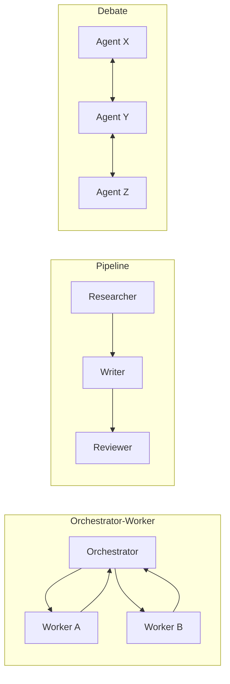

# 06 · Multi-Agent Systems 多智能体协作

> 学习目标：理解多 agent 的「适用场景」与「失败模式」，能用 LangGraph 搭建一个三角色协作 demo。

## 1. 为什么要多 agent？

单 agent 的问题：

- *上下文爆炸*：一个 agent 同时承担规划、执行、反思，prompt 越来越长。
- *角色混乱*：同一个 LLM 被要求既写代码又审代码，容易自我说服。
- *并行性差*：所有任务串行。

多 agent 的好处：

- *关注点分离*：每个 agent 有明确职责（CoALA 视角的 procedural memory）。
- *角色对抗*：让 critic 与 actor 分离，缓解自我确认偏差。
- *可并行*：独立子任务可分派给多个 worker。

## 2. 主流框架/范式

| 框架/范式 | 抽象 | 特点 |
|----------|------|------|
| **AutoGen** (Microsoft) | Conversational programming | 多 agent 通过对话协作；GroupChatManager 管轮转 |
| **MetaGPT** (Hong 2023) | SOP-driven roles | 模拟软件公司：PM/架构/工程师/QA |
| **ChatDev** (Qian 2023) | 类似 MetaGPT，瀑布式 SDLC |
| **CAMEL** (Li 2023) | Role-playing dual-agent | "AI Society" 概念，user-agent + assistant-agent |
| **Multi-Agent Debate** (Du, Liang 2023) | Debate | 多个 LLM 互相质疑，缓解幻觉 |
| **LangGraph** | Graph state machine | 显式节点 + 边，最适合工程化的多 agent |
| **CrewAI** | Crew-Task-Process | 类似 SOP，更轻量 |
| **Anthropic Research multi-agent** (2025 blog) | Orchestrator-worker | 主 agent 拆任务派给子 agent |

## 3. 经典多 agent 架构

## 4. 失败模式（Anthropic 多 agent 研究博客 2025）

- **沟通成本爆炸**：N 个 agent 全互相对话 = N² 轮 prompt。
- **回声室**：相互附和、丧失分歧。
- **责任分散**：没人对最终结果负责，质量下降。
- **错误放大**：上游 agent 的错误被下游当 ground truth。
- **token 灾难**：单 agent 跑 100 token 的任务，多 agent 可能 5000 token。

> 经验法则：单 agent + tool 已能解决就别上 multi-agent。

## 5. 必读论文与博客

- Wu et al., *AutoGen: Enabling Next-Gen LLM Applications via Multi-Agent Conversation*, COLM 2024.
- Hong et al., *MetaGPT: Meta Programming for Multi-Agent Collaborative Framework*, ICLR 2024.
- Li et al., *CAMEL: Communicative Agents for "Mind" Exploration of Large Language Model Society*, NeurIPS 2023.
- Du et al., *Improving Factuality and Reasoning in Language Models through Multiagent Debate*, ICML 2024.
- Anthropic Research, *Building a Multi-Agent Research System*, 2025 blog.

详细笔记位于 [`notes/`](./notes/)。

## 6. Notebook

[`notebooks/langgraph_three_agents.ipynb`](./notebooks/langgraph_three_agents.ipynb)：用 LangGraph 实现「研究员 + 评审 + 写手」三 agent 协作，输出一篇关于「2025 LLM Agent 进展」的小综述。

## 思考题

见 [exercises.md](./exercises.md)。
