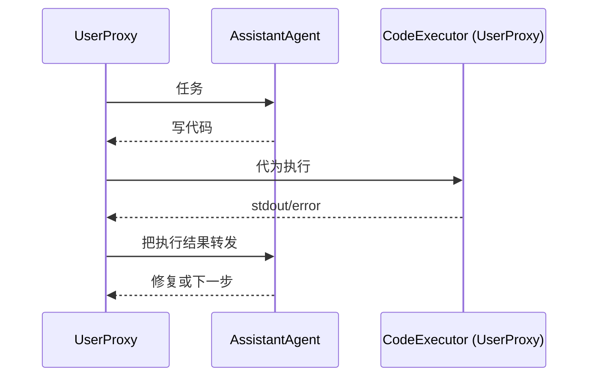

# 笔记 · AutoGen: Enabling Next-Gen LLM Applications via Multi-Agent Conversation（Wu et al., COLM 2024）

- arXiv: 2308.08155
- Microsoft / 后续演化为 AG2、Magentic-One
- 一句话精华：把 *agent 间对话* 当作核心抽象，提供 conversable agent + groupchat 来组合多 agent。

## 核心抽象

- **ConversableAgent**：能 send/receive 消息的基类。
- **AssistantAgent / UserProxyAgent**：常用的两种角色。
- **GroupChatManager**：协调多 agent 谁先发言，按 round-robin / 智能选择。

## 关键贡献

- 把 *RLHF 的 user proxy* 思想拆成可复用 agent，便于自动化。
- 内置 *code execution* agent：直接在 docker / local 执行 LLM 代码，是 CodeAct 思路的早期工程化。
- 灵活的 group chat 让用户可以快速试不同的多 agent 拓扑。

## 常见模式

| 模式 | 描述 |
|------|------|
| 1. Two-agent | Assistant + UserProxy，最常见 |
| 2. Sequential | Agent A → Agent B → Agent C，类似 pipeline |
| 3. GroupChat | N 个 agent + Manager，自由发言 |
| 4. Nested | Agent 内部嵌另一个 group chat |

## 与本仓库

- 第 07 章会用 AutoGen 实现一个 web 研究 agent，与 LangGraph / LlamaIndex / DSPy 横评。

## 我的批注

- AutoGen 的 *对话隐喻* 上手快，但生产里随着 agent 增多，调试变难——我更推荐用 LangGraph 显式画图。
- 它在 2024 还分裂成 *AG2*（社区维护）和 *AutoGen 0.4+*（重构异步版）。版本选择要看时间。
