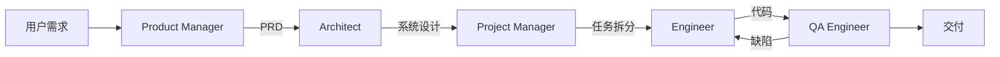

# 笔记 · MetaGPT: Meta Programming for Multi-Agent Collaborative Framework（Hong et al., ICLR 2024）

- arXiv: 2308.00352
- 一句话精华：把人类软件公司的 SOP（Standard Operating Procedure）灌进多 agent，得到能从需求自动产物（产品/设计/代码/测试）的「LLM 软件公司」。

## 角色与流程

每个角色都有：
- 明确 *输入产物*（如 PM 拿到需求，输出 PRD）
- 明确 *输出产物*（结构化文件）
- *Action 集合*（如 PM 的 action：撰写 PRD、识别竞品）

## SOP 的力量

- 把模糊的「多 agent 协作」固化为 *人类已验证的工作流*。
- 大幅降低 agent 间的「自由对话浪费」。
- 可解释性：每一步都有 artifact，可被人审核。

## 实验

- 在 SoftwareDev 任务上，相比 ChatDev / AutoGen 在代码可运行率、质量、token 成本上全面领先。
- 自动生成的项目通常包含 README、requirements、源码、单测，结构完整。

## 局限

- SOP 是 *硬编码* 的：对超出软件开发场景的任务难以泛化。
- 角色过多会引入大量 LLM 调用，token 成本极高。
- 输出质量上限受限于 LLM 单步能力。

## 与本仓库

- 与 MapAgent（11 章）思路相似：层次化角色 + 明确 SOP。
- 思考：在你的部门，「定位算法迭代」是否也可以套 MetaGPT 思想——research agent / engineer agent / eval agent 协作？

## 我的批注

- MetaGPT 启发了「让 agent 跑业务流程」的工业落地路径，比纯 chat 多 agent 务实得多。
- 但要警惕：*SOP 的预设可能掩盖 LLM 能力不足*；优化 SOP ≠ 优化 LLM。
