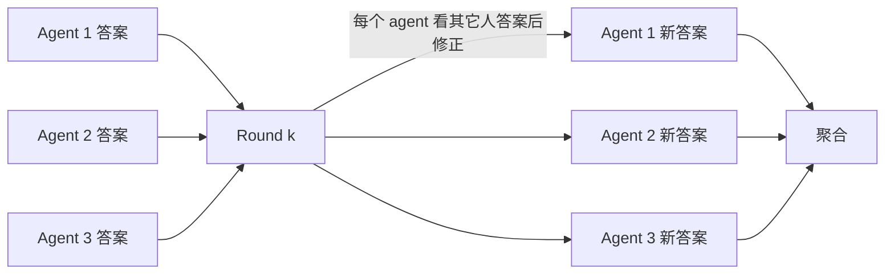

# 笔记 · Multi-Agent Debate（Du et al., ICML 2024 / Liang et al., 2023）

> 本笔记合并 Du et al. *"Improving Factuality and Reasoning in Language Models through Multiagent Debate"* (arXiv:2305.14325) 和 Liang et al. *"Encouraging Divergent Thinking in LLMs through Multi-Agent Debate"*（arXiv:2305.19118）。

## 核心思想

让 N 个 LLM 实例独立给出答案，然后看其它 agent 的回答，再修正自己的回答。多轮迭代后输出最终答案。

## 关键观察

- **事实性**：在数学、问答任务上明显减少幻觉（Du 2024）。
- **多样性**：Liang 2023 强调「不要让 agent 都同意」，加*对抗 prompt*更有效。
- **共识阈值**：常用 3 个 agent，2-3 轮 debate；再多边际收益下降，成本爆炸。

## 失败模式

- *回声室*：如果都是同一模型 + 同一 prompt，意见高度一致，debate 几乎无效。
- *固执*：模型可能死守初始答案，不为他人证据所动。
- *成本*：N agent × K round = N×K 次完整 LLM 调用。

## 实践要点

- **Diversity**：用不同 prompt persona 或不同模型供应商。
- **结构化**：让每轮 debate 输出 `agree/disagree + reason`，便于后续聚合。
- **早停**：检测到收敛（答案稳定）就停。

## 与 Self-Consistency 的差别

| 维度 | Self-Consistency | Multi-Agent Debate |
|------|------------------|--------------------|
| 是否让样本互看 | 否（独立采样） | 是（互相看后修正） |
| 聚合 | 多数投票 | LLM 综合 / 投票 |
| 适合 | 数值类、有明确正确答案 | 开放推理 |

## 评注

- Multi-Agent Debate 是 *免梯度* 的「理性化」机制；适合 high-stakes 决策（如医学、法律）做 sanity check。
- 工程注意：成本！如果不是关键节点，别动不动就 debate。
