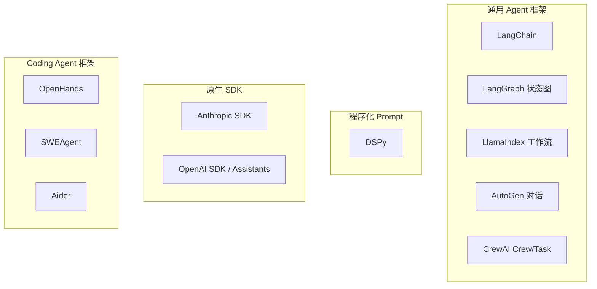
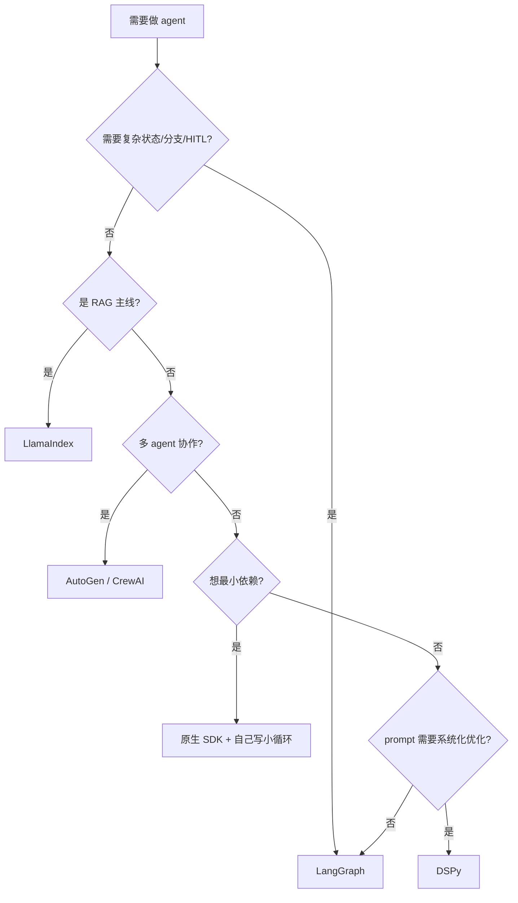

# 07 · Frameworks 框架横评

> 学习目标：能给出主流 agent 框架的「定位 / 抽象 / 取舍」对比，并在工作中给团队选型给出有依据的建议。

## 1. 主流框架地图

## 2. 一句话定位

| 框架 | 定位 | 抽象 | 适合 |
|------|------|------|------|
| **LangChain** | 早期通用胶水 | Chain / Runnable | 快速 prototype，但抽象层太多 |
| **LangGraph** | 显式状态图编排 | StateGraph + nodes + edges | 复杂、有状态、需要回溯/HITL 的 agent |
| **中国模型 API**（见 notes） | 国产模型（DeepSeek/Qwen/GLM 等）调用方式 | OpenAI 兼容 SDK | 国内部署 / 低成本 / 评测 |
| **LlamaIndex** | RAG/索引为中心 | Index + QueryEngine + Workflows | RAG 主线，结构化数据 |
| **AutoGen** | 对话式多 agent | ConversableAgent + GroupChat | 角色对话场景，研究/原型 |
| **CrewAI** | 类似 SOP 的多 agent | Crew + Task + Process | 直觉化、低代码风 |
| **DSPy** | 程序化 prompt + optimizer | Signature / Module / Optimizer | 把 prompt engineering 当编程 |
| **Anthropic SDK** | 原生 tool use | messages + tools | 不想被框架锁定 |
| **OpenHands / SWE-agent** | Coding agent | shell sandbox + 文件编辑工具 | 软件工程任务 |

## 3. 选型决策树

## 4. Notebook：同任务横评

[`notebooks/four_frameworks_research_agent.ipynb`](./notebooks/four_frameworks_research_agent.ipynb)

任务：**给定一个主题，agent 自主调用 3 个工具（search、calculator、now），生成一段简短综述**。
分别用：
1. 原生 Anthropic SDK
2. LangGraph
3. LlamaIndex Workflows
4. AutoGen 0.4

对比维度：
- 行数 / 抽象层数
- 易调试程度（trace 透明度）
- token 消耗（同输入）
- 学习曲线主观打分

## 5. 常见踩坑（来自社区）

- **LangChain 多版本不兼容**：包名/导入路径频繁变；锁版本极重要。
- **AutoGen 0.x → 0.4 迁移成本高**：异步重写 + API 大改；选型时注意。
- **LlamaIndex 高级抽象多**：`Workflows` 概念较新，文档分散；先吃透官方 quickstart。
- **DSPy 学习曲线陡**：但一旦理解 *signature + optimizer*，prompt 工程效率指数级提升。
- **CrewAI 隐藏成本**：默认配置下会触发大量隐式 LLM 调用，对 token 敏感场景需关闭。

## 6. 实用补充：中国产模型 API

[`notes/chinese_model_apis.md`](./notes/chinese_model_apis.md) 整理了 DeepSeek、Qwen、GLM、StepFun 等主流国产模型的 API 接入方式。它们大多兼容 OpenAI SDK，切换仅需改 `base_url` + `api_key`。

更偏向工具配置和 coding agent 实战的版本见：[第 13 章 · 中国模型 API 接入方案](../13_llm_agent_usage/notes/chinese_model_api_integration.md)。

## 思考题

见 [exercises.md](./exercises.md)。
