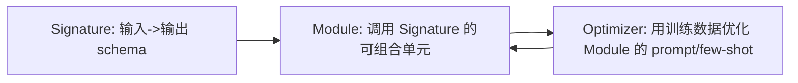

# 笔记 · DSPy: Programming Foundation Models with Text Transformations（Khattab et al., 2023-2024）

- arXiv: 2310.03714
- 一句话精华：把 prompt engineering 变成 *声明式编程*：你写 *signature 和 module*，optimizer 自动调 prompt。

## 三个核心抽象



| 抽象 | 类比 |
|------|------|
| Signature | 函数签名 |
| Module | 函数实现（可由 LLM 完成） |
| Optimizer | 编译器优化器（把高级描述编译成具体 prompt） |

## 例子（伪代码）

```python
import dspy

class GenerateAnswer(dspy.Signature):
    """根据上下文回答问题。"""
    context = dspy.InputField()
    question = dspy.InputField()
    answer = dspy.OutputField(desc="简洁答案")

class RAG(dspy.Module):
    def __init__(self):
        self.retrieve = dspy.Retrieve(k=3)
        self.generate = dspy.ChainOfThought(GenerateAnswer)
    def forward(self, question):
        ctx = self.retrieve(question).passages
        return self.generate(context=ctx, question=question)

opt = dspy.BootstrapFewShot(metric=my_em)
compiled = opt.compile(RAG(), trainset=train_data)
```

`opt.compile` 会自动给 module 选最优 few-shot、prompt 改写。

## 关键贡献

- 把 *prompt* 从「魔法字符串」升格为「可被程序优化的对象」。
- 提供多种 optimizer：`BootstrapFewShot`, `MIPROv2`（贝叶斯优化）, `BootstrapFinetune` 等。
- 模型可换：同一份 program 换 base model 重新 compile 即可。

## 限制

- 学习曲线陡（需要先理解抽象）。
- Optimizer 跑训练 *本身要花 LLM 调用*，前期投资大。
- 调试 trace 不如 LangGraph 直观。

## 与本仓库

- DSPy 适合 *RAG / 分类 / 抽取* 这种「输入-输出明确」的任务。
- 对纯 chat / 高度交互的 agent 收益相对小。

## 评注

- 个人最看好 DSPy 的方向：*让 prompt 工程退化成训练问题*。
- 业务联想：在地图问答 / POI 抽取这种半结构化任务里，DSPy 优化能稳定带来 5-15% 准确率提升。
