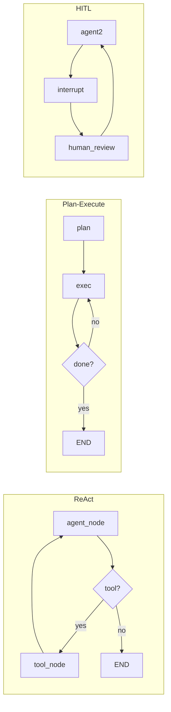

# 笔记 · LangGraph 速览（LangChain 团队，2024-）

- 文档：langchain-ai.github.io/langgraph
- 一句话精华：在 LangChain 之上加一层「显式状态图」，让多 agent / 复杂分支变得可控、可恢复、可流式。

## 核心抽象

| 概念 | 说明 |
|------|------|
| **State** | TypedDict，所有节点共享并合并 |
| **Node** | `(state) -> partial state` 的函数 |
| **Edge** | 节点之间的转移；可条件 |
| **Checkpointer** | 持久化状态（SQLite/Postgres/Memory），支持回放与人在回路 |

## 为什么不是 LangChain Chain？

- Chain 的拓扑是「一条线」或「一棵树」，难以表达 *循环 / 回退 / 多入口*。
- LangGraph 直接用图，能干净地表达 ReAct loop、Reflexion、Plan-Execute、HITL 等模式。

## 常见模式

## 为什么 *checkpointer* 重要

- 长程 agent 跑 30 分钟途中失败，能从 checkpoint 恢复。
- *Human-in-the-loop*：在敏感节点 `interrupt`，等用户确认后继续。
- *Time travel*：调试时回到某节点重跑。

## 与本仓库

- 第 06 章三角色协作 demo 已用 LangGraph。
- 第 12 章 HITL 也会用 `interrupt` 演示。

## 我的批注

- 在所有「通用 agent 框架」里，LangGraph 是 2025-2026 工业落地最普遍的选择，稳定性 / 调试性都更好。
- 对你写定位 agent 来说，`StateGraph + checkpointer` 几乎是必备：长任务必须能恢复。
