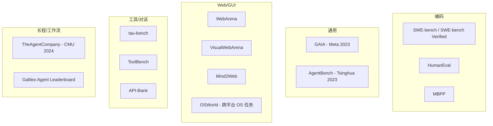
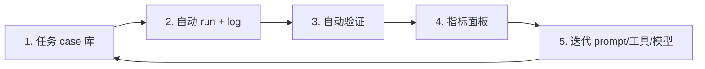

# 08 · Evaluation & Benchmarks 评测与基准

> 学习目标：掌握主流 agent benchmark 的*差异 / 局限 / 适用场景*，理解 2026 年「benchmark 饱和」的现象，并能为业务搭建一个最小可行评测 pipeline。

## 1. 主流 Benchmark 一览

## 2. 核心 benchmark 速记卡

| Benchmark | 任务类型 | 评测指标 | 备注 |
|----------|---------|---------|------|
| **SWE-bench** (Jimenez 2023) | 真实 GitHub issue 修复 | pass on hidden tests | Verified 子集 500 题质量更高 |
| **GAIA** (Mialon 2023) | 真实世界通用任务 | exact match | 三级难度，强调多步推理+工具 |
| **WebArena** (Zhou 2023) | 浏览器任务（电商/论坛） | task success | 复刻 4 个真实站点克隆 |
| **VisualWebArena** | 视觉网页任务 | task success | 加视觉理解 |
| **Mind2Web** | 真实网页操作 | element accuracy | 静态采集 |
| **OSWorld** (2024) | 跨平台桌面 OS 任务 | task success | Ubuntu/Win/macOS 应用 |
| **AgentBench** (Liu 2023) | 8 个环境综合 | 加权得分 | 早期通用 benchmark |
| **tau-bench** (Sierra 2024) | 客服多轮对话 + 工具 | success + 一致性 | 强调多轮、规则遵循 |
| **TheAgentCompany** (CMU 2024) | 模拟公司全工作流 | task completion | 测量 agent 替代员工的可行性 |
| **API-Bank / ToolBench** | 多 API 调用 | tool acc + answer acc | 工具调用 benchmark 老牌 |

## 3. 2026 视角：饱和与下一代

**现状**（截至 2026）：
- SWE-bench Verified、WebArena、GAIA、AgentBench 已被前沿模型刷到 85-95%。
- 三年前 SWE-bench 50% 被视为 moonshot，如今司空见惯。
- 这意味着旧基准的判别力大幅下降。

**下一代评测方向**：
1. **长程任务**（multi-day / multi-week 工作）。
2. **不确定性下的自治**：噪声、对手、不完整信息。
3. **工具可靠性**：能否正确处理超时、失败、限流。
4. **对抗鲁棒性**：prompt injection / 数据中毒。
5. **真实经济价值**：替代员工的小时数 / 节省的成本。

> 推荐阅读：*AI Agent Benchmarks Broken: What Comes Next*（dev.to, 2025）；*Comprehensive Survey on Benchmarks and Solutions in SWE Agents*（arXiv:2510.09721）。

## 4. 业务落地：怎么自建评测？

要点：
- *任务 case 库*：从真实业务采样，按难度/场景分层。
- *自动验证*：能自动判定就别人工——用规则、单测、LLM-judge。
- *多维指标*：不只是 acc，还要 token、时延、失败模式分布。
- *版本对比*：每次 prompt/模型变更都要跑 regression。
- *LLM-as-Judge 注意事项*：成对比较优于评分；用强模型判弱模型；多 judge 投票。

## 5. Notebook

[`notebooks/agent_eval_pipeline.ipynb`](./notebooks/agent_eval_pipeline.ipynb)：
搭一个最小评测 pipeline：定义 10 道带 ground-truth 的多跳 QA → 跑 ReAct agent → 用 LLM-judge 评分 → 输出 leaderboard。可作为业务评测的模板。

## 6. 必读论文

详见 [`notes/`](./notes/)：

- SWE-bench / SWE-bench Verified
- GAIA
- WebArena
- tau-bench
- TheAgentCompany

## 思考题

见 [exercises.md](./exercises.md)。
