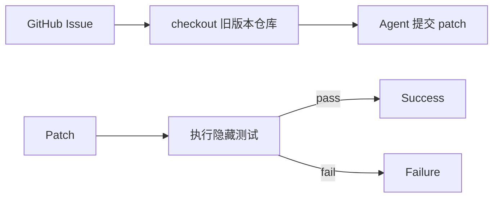

# 笔记 · SWE-bench / SWE-bench Verified（Jimenez et al., 2023-2024）

- arXiv: 2310.06770
- ICLR 2024
- 一句话精华：从 12 个真实 Python 仓库采集 2294 条 issue+PR，让模型修复 bug，用 *仓库自带的隐藏测试* 自动判分。

## 评测流程

- 公平：测试是真实的、隐藏的、由人维护。
- 难：需要理解大型代码库、多文件改动、跨模块依赖。

## 关键变体

| 名称 | 描述 |
|------|------|
| **SWE-bench Lite** | 300 题子集，单文件改动为主 |
| **SWE-bench Verified** (OpenAI 2024) | 人工筛选 500 题质量高 |
| **SWE-bench Multimodal** | 含截图、页面渲染 |
| **SWE-bench Multilingual** | 多语言版本 |

## 指标演进

- 2023 Q4：Top model（带 retrieval+ReAct）约 12-15% pass。
- 2024 Q4：Devin/Cognition 接近 13% → SWE-agent 提升到 25-30% → Claude / GPT 升级后 50%+。
- 2025-2026：顶级 coding agent 在 Verified 上 **70-90%+** 已不罕见。

## 对应工具/Agent

- **SWE-agent** (Yang 2024)：第一个面向 SWE-bench 的 *Agent-Computer Interface*，定义文件浏览、编辑、命令行 4 类工具。
- **Aider / OpenHands / Devin / Claude Code**：商业 + 开源 coding agent，都用 SWE-bench 报数。

## 局限

- 仅 Python。
- 测试覆盖不全：有些 issue 即使 fail tests 也是合法解。
- 越被刷到饱和，越变成 *over-engineering benchmark*。

## 评注

- SWE-bench 是 2024-2025 *最有影响力* 的 agent benchmark，直接催生了 coding agent 商用化。
- 2026 年看：分数高不代表「真能用」，建议结合 *自家代码库* 自建 SWE-bench-style 评测。
