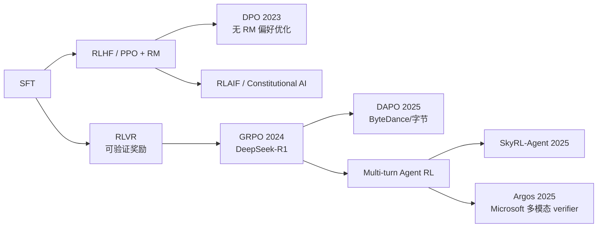
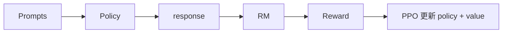

# 09 · Agent RL Training Agent 强化学习训练前沿

> 学习目标：搞懂从 *RLHF → DPO → RLVR → 多轮 Agent RL* 的演进，能讲清 GRPO/DAPO 的算法形式与工程权衡，能用 `trl` 跑通最小 GRPO 实验。
>
> 这是本仓库最 *研究导向* 的章节，与你的算法岗背景最契合。

## 1. 演进图

## 2. 核心算法速记

### 2.1 RLHF + PPO（InstructGPT, Ouyang 2022）

经典三步：SFT → RM → PPO。需要训 Reward Model（RM），再用 PPO 优化 policy 让 RM 给的分高。

### 2.2 DPO（Direct Preference Optimization, Rafailov 2023）

> 「不用 RM 也能学偏好」

直接在偏好数据 `(prompt, chosen, rejected)` 上做闭式更新，等价于 RLHF 但不需 RM、不需 RL 训练循环。loss：

\[
\mathcal L_{\text{DPO}} = -\log\sigma\left(\beta\log\frac{\pi_\theta(y_w|x)}{\pi_{\text{ref}}(y_w|x)} - \beta\log\frac{\pi_\theta(y_l|x)}{\pi_{\text{ref}}(y_l|x)}\right)
\]

### 2.3 RLVR（Reinforcement Learning from Verifiable Rewards）

> 「不要人，要可验证的奖励」

适用任务：数学（答案可验证）、代码（可运行）、形式证明（可机械检查）。
代表工作：Tülu 3、DeepSeek-R1、Qwen2.5-Math、AlphaProof。

优势：
- *可扩展*：rewards 由代码/编译器/求解器生成。
- *抗 reward hacking*：客观判定难被 game。
- *经济*：不需要标注员。

### 2.4 GRPO（Group Relative Policy Optimization, DeepSeek 2024）

GRPO 是 PPO 的「省内存版」：**不要 value model**，对每个 prompt 采样一组 $G$ 个 response，把组内 reward 标准化后当 advantage：

\[
A_i = \frac{r_i - \mu_G}{\sigma_G}
\]

代表应用：DeepSeek-R1、DeepSeek-R1-Zero（直接 RL，无 SFT 启动）。

### 2.5 DAPO（ByteDance 2025）

GRPO 的稳定性改进版，关键技巧：

- **Clip-Higher**：放宽上界 clip 比 PPO 更鼓励探索。
- **Dynamic Sampling**：丢弃组内全对/全错的样本，保留有梯度的部分。
- **Token-Level Loss**：长序列里小 token 也有合适权重。
- **Overlong Reward Shaping**：长样本 soft penalty。

DAPO 把 Qwen2.5-32B 训到 AIME 2024 50 分，超 DeepSeek-R1-Zero。

### 2.6 多轮 Agent RL（前沿）

经典 PPO/GRPO 假设 *单轮* 输出，但 agent 是 *多轮* 任务（一次 trajectory = 几十轮 LLM + 工具调用）。

挑战：
- *Credit assignment*：reward 在终态才有，前面每一步该怎么分配？
- *Async dispatch*：长 trajectory 的工具执行很慢，需要异步并行。
- *Verifier 设计*：多模态（屏幕截图）/ 多步任务的 verifier 不容易写。

代表工作：
- **SkyRL-Agent (2025)**：异步 dispatch + 多轮 RL，SWE-Bench 39.4% Pass@1，2× 成本下降。
- **Argos (Microsoft 2025)**：多模态 *agentic verifier*，给 reward 时同时评估准确性、空间定位、推理质量。
- **Agent RLVR**：把 RLVR 思想搬到 multi-step agent。

## 3. 与你的算法背景的连接

- *RL 基础（PPO/A2C/MDP/Actor-Critic）* → 你应该已掌握；GRPO 实质是「去 critic 化 + 组内 baseline」的 trick。
- *Reward shaping*：与定位算法中的「损失函数设计」类比；好 reward = 好梯度。
- *Off-policy / replay buffer*：在 SkyRL-Agent 里仍重要。

## 4. Notebook

[`notebooks/grpo_minimal.ipynb`](./notebooks/grpo_minimal.ipynb)：
用 `trl` 在小模型（如 Qwen2.5-0.5B）上跑一个最小 GRPO 实验，任务是「输出 "答案是 X" 格式的简单算术题」，reward 用正则匹配验证。
> 可在单卡 8GB 显存上跑通；如无 GPU 可读 + 跑 CPU smoke test。

## 5. 必读论文

详见 [`notes/`](./notes/)：

- *DPO*（Rafailov 2023）
- *DeepSeek-R1*（GRPO，2024-2025）
- *DAPO*（ByteDance 2025）
- *SkyRL-Agent*（2025）
- *Argos*（Microsoft 2025）

## 思考题

见 [exercises.md](./exercises.md)。
