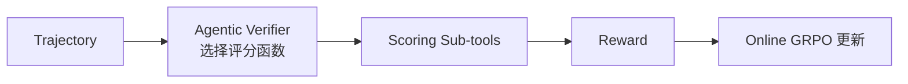

# 笔记 · Argos: Multimodal RL with Agentic Verifier（Microsoft Research, 2025）

- 一句话精华：用一个 *agentic verifier*（本身也是一个 LLM agent）当 reward signal，对多模态 agent 任务做在线 RL，缓解 reward hacking。

## 动机

- 多模态 agent（GUI 操作、视觉问答）很难写规则验证 reward。
- 用 *固定 reward model* 易 reward hacking（model 学会 game RM）。
- 用 *人工标注* 不可扩展。

## 思路

让 verifier 自己变成 *agent*：根据任务类型动态选择评分函数（accuracy、spatiotemporal localization、reasoning quality），并能多步推理后再给分。

## 关键发现

- **SFT 不够**：纯 SFT 多模态 agent 在线测试时容易崩。
- **静态 RM 易被 hack**：在 RL 过程中 RM 自身能力跟不上 policy。
- **Agentic verifier**：动态、多视角的 reward 评估显著抑制 hacking，提升泛化。

## 与 RLVR 的关系

- RLVR 假设有 *客观可验证* 的 reward；这在数学/代码任务里成立，但在 *视觉/多模态/开放任务* 里不成立。
- Argos 介于 RLVR 与 RLHF 之间：reward 既不是简单规则也不是单一 RM，而是 *组合式 agentic 评估*。

## 我的批注

- Argos 体现了 *verifier 也要 agent 化* 的趋势：reward 函数本身需要 reasoning 能力。
- 业务联想：在地图 agent 任务中，「答案是否合理」往往要综合空间约束 + 用户偏好 + POI 数据，正适合用 agentic verifier。
