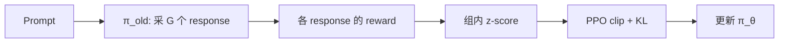

# 笔记 · GRPO 与 DeepSeek-R1（Shao 2024 / DeepSeek 2025）

- DeepSeek-R1 论文: arXiv:2501.12948
- GRPO 提出: DeepSeek-Math (arXiv:2402.03300)
- 一句话精华：GRPO 用 *组内相对 advantage* 替代 value model，把 PPO 的内存与训练复杂度大幅压低；DeepSeek-R1 在此之上用纯 RL（甚至无 SFT 启动，R1-Zero）让 LLM 涌现长 CoT 推理。

## GRPO 算法

对每个 prompt $x$ 采样 $G$ 个 response $\{y_1,\dots,y_G\}$，得到 reward $r_i$。

组内归一：

\[
A_i = \frac{r_i - \mu(\{r_i\})}{\sigma(\{r_i\})}
\]

policy 损失（PPO-style 截断）：

\[
\mathcal L = -\mathbb E\left[\min\left(\frac{\pi_\theta}{\pi_{\theta_{\text{old}}}} A_i, \mathrm{clip}\left(\frac{\pi_\theta}{\pi_{\theta_{\text{old}}}}, 1-\epsilon, 1+\epsilon\right) A_i\right)\right] + \beta \mathrm{KL}(\pi_\theta \| \pi_{\text{ref}})
\]

## 优点

- **省内存**：不要 value model（≈ 大模型自身大小，省一半显存）。
- **稳定**：组内归一化天然抑制 reward scale 漂移。
- **天然适配 RLVR**：reward 来自验证器（数学/代码可执行）。

## DeepSeek-R1 的关键发现

- *R1-Zero*：纯 RLVR 启动（无 SFT），从 base model 直接 RL，模型涌现长 CoT、自我反思。
- *R1*：在 R1-Zero 基础上加一轮 SFT + RL，可读性更好，性能 SOTA 级。
- *Distillation*：用 R1 输出的 CoT 数据蒸馏到小模型（7B/14B/32B），效果 surprisingly 强。

## 实验亮点

- DeepSeek-R1 在 AIME 2024 (79.8%)、MATH-500 (97.3%)、Codeforces ELO 等多个推理基准达到/接近闭源 SOTA。
- 蒸馏出的 7B/14B 推理模型也胜过同规模闭源对手。

## 工程要点

- **Reward 设计**：对数学题用「正则匹配最终答案」即可；对代码用单测；对 agent 多步任务，要分层 reward。
- **KL 锚**：`β` 不能太大（学不动）也不能太小（爆掉），常用 0.001-0.04。
- **采样组大小 G**：常见 8-64；大 G 方差小但贵。

## 与本仓库

- Notebook 用 `trl` 的 GRPO trainer 在小模型上演示一个最简任务。
- 在你的算法岗工作里，*把业务里能验证的 reward 抽出来* 就能套这套范式（如「能否被传统定位算法验证」）。

## 我的批注

- GRPO 是 2024-2026 *最重要的 LLM 后训练算法*，掌握它几乎是算法岗 agent 方向的入场券。
- R1-Zero 的「无 SFT 直接 RL」打破了 RLHF 时代的固定流程；意味着 RL 本身能催化能力涌现。
