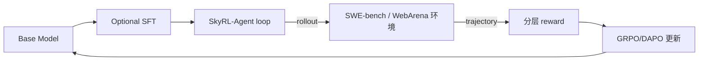

# 笔记 · SkyRL-Agent（2025）

- arXiv: 2511.16108
- 一句话精华：面向 *多轮长程* agent 任务的高效 RL 训练框架；异步 dispatch + 工具集成 + 算法创新，把 SWE-Bench 训练成本砍半。

## 核心问题

经典 GRPO 假设单 prompt → 单 response。Agent trajectory 是几十轮 LLM 调用 + 工具执行：

- 每轮的工具执行（编译、跑单测、搜索）耗时不等。
- 同一 batch 中不同 trajectory 长度差几十倍。
- 直接套 GRPO 会让 GPU 大量空转等工具。

## SkyRL-Agent 的关键贡献

1. **Async Dispatch**：trajectory rollouts 与 LLM forward/backward 解耦，工具执行不阻塞 GPU。
2. **多 RL 算法支持**：GRPO、DAPO、PPO 在同一框架下随时切换。
3. **Tool Integration Layer**：抽象化 sandbox / VM / agent runtime，便于接入 SWE-bench 等环境。
4. **Reward 分层设计**：长 trajectory 的稀疏 reward 通过中间 verifier（如单测部分通过率）做 shaping。

## 实验

- 在 SWE-Bench 上把 Pass@1 从基线 28% 提升到 39.4%（SA-SWE-32B）。
- 训练成本相比前 SOTA 减半。
- 模型权重 + 框架开源。

## 与 veRL / OpenRLHF 的关系

- **veRL**（ByteDance 开源）：通用 RL post-training 框架，支持 GRPO/DAPO，强调 scaling。
- **OpenRLHF**：开源社区 PPO/DPO 实现。
- **SkyRL-Agent**：veRL/OpenRLHF 的 *agent 任务专用* 上层，强调 multi-turn + tool dispatch。

## 评注

- 这是 2025 年 agent RL 训练 *从理论到实操* 的代表工作之一，对工业落地有直接参考价值。
- 业务落地：把业务任务（如定位/导航流程）抽象成「环境 + 自动验证器」，是 agent RL 切入垂直业务的入口。
