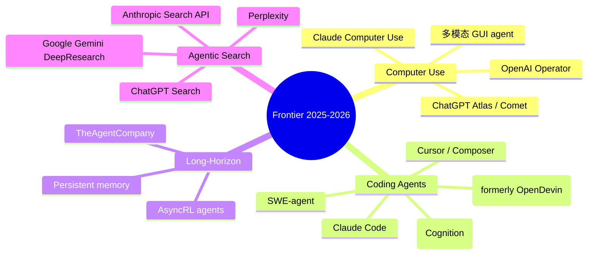
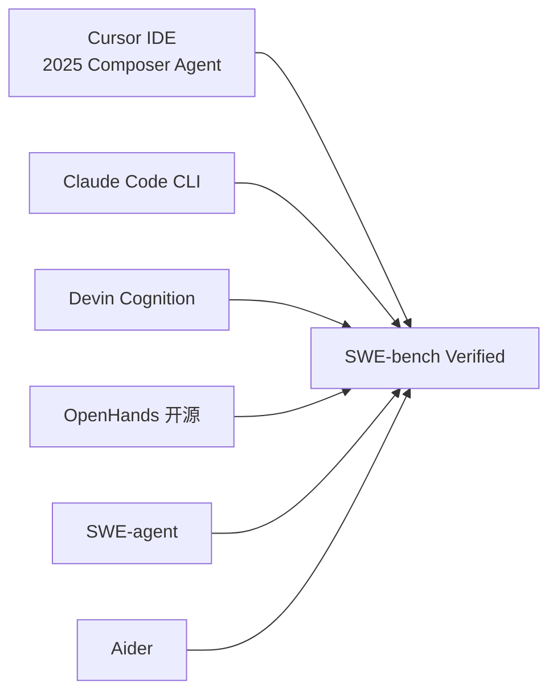

# 10 · Frontier 2025-2026 前沿专题

> 学习目标：建立一份「2025-2026 LLM Agent 生态地图」，能讲清当下趋势的脉络。

## 1. 前沿四大方向

## 2. Computer Use / Browser Use

### 代表

- **Claude Computer Use**（Anthropic 2024-10）：模型直接看屏幕截图、操控键鼠。
- **OpenAI Operator**（2025-01）：基于 CUA（Computer-Using Agent），先在沙盒浏览器，后扩展到桌面。
- **ChatGPT Atlas / Perplexity Comet**（2025）：浏览器作为 agent host。
- **Microsoft Magentic-One** / **AutoGen 0.4**：本地 GUI 自动化框架。

### 核心挑战

- 视觉理解 + 元素定位（grounding）。
- 长 trajectory（30+ 步）。
- 安全：误操作可能写入用户数据。

详见 [`notes/computer_use.md`](./notes/computer_use.md)。

## 3. Coding Agents

详见 [`notes/coding_agents.md`](./notes/coding_agents.md)。

**深度补充**：
- [`notes/coding_agents_deep.md`](./notes/coding_agents_deep.md)：IDE / CLI / Cloud 三形态详细比较、日常 workflow、CI 集成、安全实践。
- [`notes/skill_mechanism.md`](./notes/skill_mechanism.md)：Cursor Skill / Hook 等 coding agent 技能注入机制的原理与接入方式。
- [`notes/skill_writing_guide.md`](./notes/skill_writing_guide.md)：Skill 编写实战指南，覆盖代码 review、学术代码、论文修改、办公软件、Git / DevOps 等场景的完整 SKILL.md 模板。

如果目标是直接上手使用和配置工具，优先阅读新的实用目录：[第 13 章 · LLM Agent 使用实战](../13_llm_agent_usage/)。

## 4. Long-Horizon Execution

- 任务跨度从分钟级 → 小时 / 天 / 周。
- 关键技术：分层规划、长期记忆、状态恢复、人机协作。
- 评测：TheAgentCompany、SkyRL-Agent 长 trajectory benchmark。

详见 [`notes/long_horizon.md`](./notes/long_horizon.md)。

## 5. Agentic Search

- 从「搜索结果列表」到「主动综述 + 引用」。
- 代表：Perplexity Pro、ChatGPT Search、Gemini DeepResearch、Claude with Search。
- 趋势：搜索 + agent 的边界模糊化；SearchGPT 是 *agent in the search box*。

详见 [`notes/agentic_search.md`](./notes/agentic_search.md)。

## 6. 其它值得关注

- **Sleep-time compute**：模型在「空闲时」自我反思 / 准备记忆 / 预热缓存。
- **Agent self-improvement loops**：用 agent 跑 agent 的训练数据生成；Andrew Ng 强调的「Agentic Workflow」之上更进一步。
- **MCP 生态爆发**：2025-2026 GitHub 上 MCP server 数量急增，从工具到自动化的 *组件化* 趋势。
- **Agent + 物理世界**：从纯 GUI 到机器人 / 自动驾驶 / 智能眼镜（与第 11 章桥接）。

## 7. 「2026 关键观察」

1. **「框架战」尘埃落定**：LangGraph、LlamaIndex、Anthropic SDK 三足鼎立；DSPy 在 prompt 优化上独占一席。
2. **后训练比前训练更值钱**：RLVR + GRPO/DAPO 是新的 SOTA 模型主线；闭源前沿与开源差距来自后训练。
3. **Coding Agent 是第一个真正商业化的 agent 品类**：Cursor、Claude Code、Devin 都已 ARR 上亿。
4. **垂直 agent 起势**：客服（tau-bench → Sierra）、地图（MapAgent）、医疗、法律。
5. **评测重心转向真实经济价值**：TheAgentCompany 类 benchmark 兴起。

## 思考题

见 [exercises.md](./exercises.md)。
