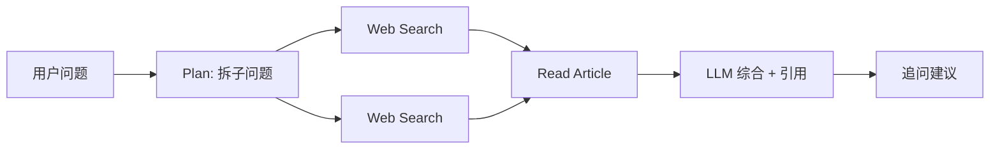

# 笔记 · Agentic Search 智能搜索（2024-2026）

> 从「关键词 → 蓝色链接列表」到「问题 → 结构化综述 + 引用 + 可后续追问」。

## 代表产品

| 产品 | 厂商 | 特点 |
|------|------|------|
| **Perplexity** | Perplexity AI | 早期主流 agentic search；Pro 模式带迭代检索 |
| **ChatGPT Search** | OpenAI | 内嵌 ChatGPT，深度结合对话 |
| **Gemini DeepResearch** | Google | 多步研究 → 结构化报告 |
| **Claude Search API** | Anthropic | 官方搜索工具，agent 友好 |
| **You.com / SearchGPT** | 各家 | 形态相似 |
| **Perplexity Comet / ChatGPT Atlas** | 浏览器形态 | 把 agent 嵌入浏览器 |

## 架构（典型）

## 关键技术

- **Query decomposition**：把复杂 query 拆成 sub-questions（与 Agentic RAG 同源）。
- **Iterative deepening**：先广撒网再钻深，Perplexity Pro / DeepResearch 都用这套。
- **Citation grounding**：每一句对应一个来源，提供可点击链接。
- **Reranking**：用 cross-encoder 给搜索结果重排，提升 top-k 命中。
- **Anti-hallucination**：模型只在「证据出现 + 高置信」时才下结论。

## 与传统搜索的差异

| 维度 | 传统搜索 | Agentic Search |
|------|---------|----------------|
| 输入 | 关键词 | 问题/任务 |
| 输出 | 链接列表 | 直接答案 + 引用 |
| 决策权 | 用户 | 模型 + 用户 |
| 商业模式 | 广告 | 订阅 / API |

## 趋势 2026

- *搜索 ↔ Chat ↔ Agent* 三者边界模糊：Perplexity Comet 既是浏览器又是 chat 又是 agent。
- *深度研究模式*（DeepResearch）是杀手级应用：5 分钟查 50 来源 → 一份结构化报告。
- 引发*出版业 / SEO* 大震荡：流量从搜索引擎被 agent 截胡。

## 我的批注

- 对算法岗：可以把这套架构看成 *Agentic RAG 在 web 维度的极致版*；Query decomp + 多轮 retrieval + LLM 综合的设计模式高度可借鉴。
- 业务联想：地图业务里「行程规划」、「景点比较」、「实时事件影响导航」类需求，本质就是 agentic search 在垂直领域的复刻。
