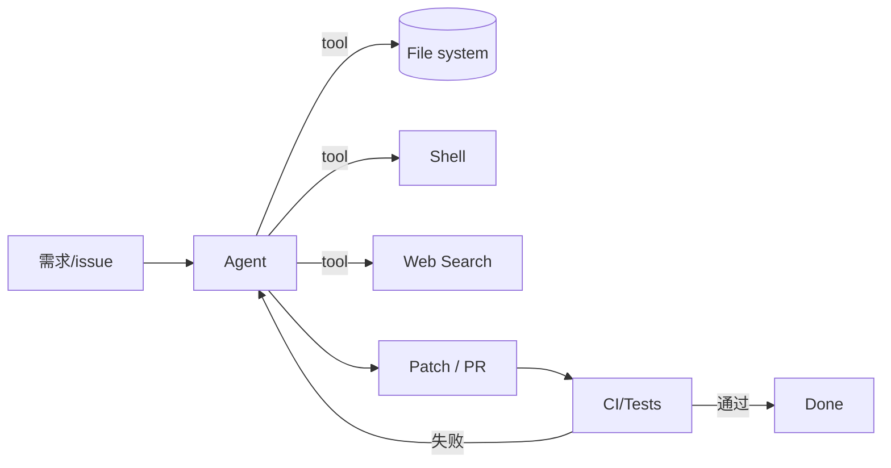

# 笔记 · Coding Agents 编码 Agent（2024-2026）

## 代表

| Agent | 厂商 / 来源 | 形态 |
|------|------------|------|
| **Cursor / Composer** | Cursor / Anysphere | IDE-native agent + 多步编辑 |
| **Claude Code** | Anthropic | CLI-native agent |
| **Devin** | Cognition AI | 云端自治软件工程师 |
| **OpenHands** (前 OpenDevin) | 开源 | 开放架构，可换底层 |
| **SWE-agent** | Princeton | 学术开源，定义 ACI |
| **Aider** | 个人维护 | 终端 + git 友好 |
| **Codex CLI** | OpenAI | 命令行 coding agent |
| **Bolt.new / v0 / Lovable** | StackBlitz / Vercel / Lovable | Web 端「想法 → 应用」 |

## 共同抽象（Agent-Computer Interface, SWE-agent 提出）

- **文件浏览**：`open / scroll / search`。
- **编辑**：`edit_file(path, line, content)` 或 search-replace。
- **shell**：执行命令、跑测试。
- **search**：仓库内 / 网页搜索。

## 关键差异

| 维度 | IDE 内（Cursor） | CLI（Claude Code/Aider） | 云端（Devin） |
|------|-----------------|--------------------------|----------------|
| 集成 | 紧耦合编辑器 | 独立、跨语言 | 全自治、自带 VM |
| 用户介入 | 高（人审编辑） | 中 | 低（看报告） |
| 适用 | 日常编码 | 脚本/小项目 | 长任务、远程 |

## 训练

- 多数闭源 coding agent 用「base 模型 + agent SFT + agent RL」三段式。
- 开源最强（如 *Devstral*、*Claude Code* base、*Qwen-Coder-Max*）也走类似路线。
- *SWE-bench Verified* 是事实通用测分尺；70-90%+ 已是 2026 顶级水位。

## 启示

- Coding agent 是当前 *最成熟* 的 agent 商用品类（验证容易、价值高）。
- Agent 对 IDE 的渗透速度远超预期：Cursor 已成为 2025-2026 主流编辑器之一。
- 你的工作里：把内部「代码 review / 故障复现 / 监控告警自动定位」抽象成 coding-agent-like 任务，能直接复用这条 stack。

## 论文

- Yang et al., *SWE-agent: Agent-Computer Interfaces Enable Automated Software Engineering*, NeurIPS 2024.
- Wang et al., *OpenHands*, 开源 white paper 2024.
- Pan et al., *Training Software Engineering Agents and Verifiers with SWE-Gym*, 2024.
- 各厂商 release notes / engineering blogs。
