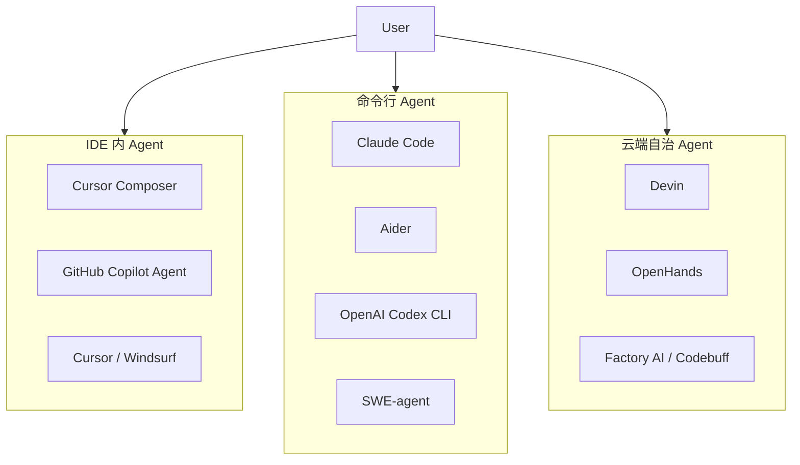
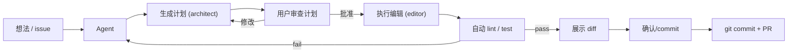

# 笔记 · Coding Agent 深度专题

> 补充前一篇笔记未覆盖的内容：完整对比 IDE / CLI / Cloud 三类 coding agent 的详细能力，以及实用接入方案。

## 1. Coding Agent 全景：IDE 内 / CLI / 云端



### 1.1 IDE 内 Agent

| 工具 | 厂商 | 核心能力 | 独家卖点 |
|------|------|---------|---------|
| **Cursor Composer** | Cursor (Anysphere) | 多文件编辑、lint 修复、内联对话 | Tab 补全+Agent 双模式；以 diff 形式展示编辑 |
| **Copilot Agent** | GitHub (Microsoft) | 基于 VS Code，issue → PR 全流程 | 深度 GitHub 生态；Actions / Projects 联动 |
| **Windsurf / Cascade** | Codeium | 编辑器内 agent + 函数调用 | 对大型库索引快 |

**IDE Agent 的关键技术**：
- **File-aware context**：自动感知打开的文件、项目结构、语言。不把整个项目塞给模型，而是用 *最小上下文窗口* 定位相关文件。
- **Lint-aware edits**：编完后跑 lint，失败了回退重试。
- **Diff 展示**：不以全文件替换，而是行级 diff，用户可见可改。
- **引用搜索**：`grep` / `find references` 集成到 agent 的工具链里。

### 1.2 CLI Agent

| 工具 | 厂商 | 核心能力 | 独家卖点 |
|------|------|---------|---------|
| **Claude Code** | Anthropic | 终端内 agent，file/edit/shell/search | 最长上下文（200K+）；`claude` 命令直接可用 |
| **Aider** | Paul Gauthier | 纯终端，architect / editor 双模式 | git-aware，自动 commit，支持多模型后端 |
| **Codex CLI** | OpenAI | 终端 coding agent | 基于 o3/o4-mini，轻量 |
| **SWE-agent** | Princeton | 学术基准级 ACI 定义 | 先定义「agent 与计算机的接口」(ACI)，工具边界最清晰 |

**CLI Agent 的关键技术**：
- **git 集成**：自动创建分支、stage、commit。让 agent 的每次改动可追溯、可 rollback。
- **architect/editor 双角色**（Aider 范式）：大模型 architect 先生成计划，小模型/同一模型 editor 按计划执行，效率更高。
- **shell 安全沙箱**：默认只读执行，写操作要用户确认或走 HITL。
- **多文件搜索-替换**：用 `find` + `sed` / 类 `grep` 模式批量改。

### 1.3 云端自治 Agent

| 工具 | 厂商 | 核心能力 | 独家卖点 |
|------|------|---------|---------|
| **Devin** | Cognition AI | 全栈自治软件工程师：IDE + shell + browser + 部署 | 自带云端环境，跑完整开发流程 |
| **OpenHands** | 开源社区 | 开放架构，可换底层模型 | 可自托管，适合企业内部部署 |
| **Factory / Codebuff** | Factory AI | 轻量云端 AI coder | 专注于修复和重构 |

**Cloud Agent 的关键技术**：
- **sandboxed environment**：每个任务独享容器，有独立的文件系统、网络、shell。
- **long-horizon 规划**：任务可能跨小时-天，需要分层规划 + checkpoint 恢复。
- **externalized thinking**：把推理过程写入「scratchpad.md」，下次启动时加载，缓解上下文窗口限制（参考 Devin 架构博客）。

### 1.4 能力对比矩阵

| 维度 | IDE Agent | CLI Agent | Cloud Agent |
|------|-----------|-----------|-------------|
| **用户介入程度** | 高（逐 diff 确认） | 中（shell 级确认） | 低（看最终产出） |
| **上下文长度敏感** | 中（受限于 IDE 性能） | 高（Claude Code 200K+） | 中（可借助外化 scratchpad） |
| **多文件编辑** | ⭐⭐⭐ | ⭐⭐⭐ | ⭐⭐⭐ |
| **git 集成** | ⭐⭐ | ⭐⭐⭐ | ⭐⭐⭐ |
| **lint/错误修复** | ⭐⭐⭐ | ⭐⭐ | ⭐⭐ |
| **部署能力** | ⭐ | ⭐ | ⭐⭐⭐ |
| **成本** | 低（按 editor 订阅） | 中（按 token） | 高（按任务） |

## 2. Coding Agent 的使用方案

### 2.1 日常工作流



### 2.2 CI 集成方案

Coding Agent 不只是「开发时用」，也可以集成进 CI 管线：

| 场景 | 方案 | 工具 |
|------|------|------|
| PR 自动 review | agent 读 diff + 提意见 | OpenHands + GitHub App |
| bug fix 自动提交 | agent 读 stack trace → 提出修复 PR | SWE-agent + Issue 触发器 |
| 自动重构 | 定时 agent 扫描 dead code → 批量清理 | Factory / 自研 |
| 文档自动补全 | agent 读函数签名 → 生成 docstring | Aider / Claude Code API |

示例：CI 里触发 SWE-agent 修复 lint 错误

```yaml
# .github/workflows/lint-fix.yml
name: AI Lint Fix
on:
  pull_request:
    types: [opened, synchronize]
jobs:
  lint-fix:
    runs-on: ubuntu-latest
    steps:
      - uses: actions/checkout@v4
      - name: Run linter
        run: ruff check . --output-format=github
      - name: AI fix if lint fails
        if: ${{ failure() }}
        env:
          ANTHROPIC_API_KEY: ${{ secrets.ANTHROPIC_API_KEY }}
        run: |
          pip install swe-agent
          sweagent run \
            --agent.model.name=claude-sonnet-4-20250514 \
            --problem_statement="修复上面 lint 报出的所有错误，保持功能不变" \
            --repo_path=.
      - name: Commit fixes
        run: |
          git config user.name "ai-lint-fixer"
          git add -A && git diff --cached --quiet || \
          git commit -m "ci: auto-fix lint errors [skip ci]"
          git push
```

### 2.3 安全实践

Coding Agent 可以读写文件、执行 shell，安全风险比对话式 agent 更高：

1. **最小权限**：默认只读，写操作弹 HITL。
2. **沙箱**：CI 场景跑在容器里，对宿主机只读挂载。
3. **review before commit**：绝不绕过 PR review 流程直接 push main。
4. **审计日志**：记录 agent 的每条 shell 命令和文件修改。
5. **rate limit agent**：避免 agent 陷入无限循环（max steps = 30-50）。

## 3. 典型应用模式

| 模式 | 描述 | 适用场景 |
|------|------|---------|
| **Single-shot** | 一次 prompt → 完整文件/代码 | 写 UT、写文档 |
| **Iterative** | prompt → agent 改 → lint/run → 改 → ... | 修 bug、调样式 |
| **Explore-fix** | agent 先读整个代码库 → 定位问题 → 修复 | 迁移、重构 |
| **Plan-execute** | architect 生成计划 → editor 逐步执行 | 大型 feature 开发 |
| **Multi-file** | 一次修改跨多个文件，自动维护一致性 | Refactor（改名、接口变化） |

## 4. 与本章其它笔记的关联

- Coding Agent 本质是最成熟的 **Computer Use** 垂直子类（见 `computer_use.md`）。
- SWE-agent 定义的 ACI 是 **Tool Use** 思想在软件工程上的具象化（第 03 章）。
- 多个 coding agent 可组成 **Multi-Agent** 协同工作（第 06 章），如 Devin 内部推测就是多个 agent 协作。
