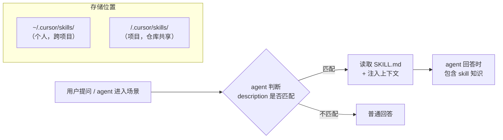

# 笔记 · Coding Agent 的 Skill 机制

> 以 Cursor 的 Agent Skills 为典型案例，讲解 coding agent 中「技能 / Skill」的设计原理与接入方式。
> 这个模式不是 Cursor 独有的——Claude Code 的 hooks、Aider 的「architect mode」本质上都走类似思路。

## 1. 为什么需要 Skill？

Coding agent 的核心能力来自 LLM，但 LLM 不知道 *你的团队规范 / 你的代码库约定 / 你的私有 API 用法*。Skill 就是填补这个 gap 的机制：**让 agent 在需要时能读到自定义的领域知识或工作流程**。

Skill 本质上是一个 *按需加载的 system prompt 片段*。

## 2. Skill 的工作原理



### 2.1 发现机制

每个 skill 在 `SKILL.md` 的 frontmatter 里有一个 `description` 字段。agent 启动时会扫描所有 skill 的 description，形成一份 *摘要表（约 50-100 tokens）* 出现在 system prompt 里。

| 字段 | 内容 | 用途 |
|------|------|------|
| `name` | 标识符，如 `code-review` | agent 引用时使用 |
| `description` | 一段话，描述 skill 做什么、何时触发 | agent 据此判断是否加载该 skill |

### 2.2 注入机制

当 agent 判定一个 skill 匹配当前场景时，它会读取 `SKILL.md` 的内容并注入到 context 中。skill 的内容可以是：

- 指令型：「按这个 checklist 做 code review」
- 知识型：「我们的 API 规范是 X」
- 模板型：「commit message 按这个格式」
- 脚本型：「用这个命令跑测试」

### 2.3 存储位置

| 位置 | 作用域 | 谁管理 |
|------|--------|--------|
| `~/.cursor/skills/<name>/SKILL.md` | 当前用户，所有项目 | 个人 |
| `<project>/.cursor/skills/<name>/SKILL.md` | 该项目，所有协作者 | 版本控制 |

## 3. Skill 的文件结构

```
skill-name/
├── SKILL.md              # 主文件（必需）
├── reference.md          # 详细参考（可选）
├── examples.md           # 示例（可选）
└── scripts/              # 脚本（可选）
    ├── validate.py
    └── helper.sh
```

`SKILL.md` 的格式：

```markdown
---
name: skill-name
description: 一句话描述技能和触发场景
---

# 技能标题

## 核心指令
[agent 需要遵循的步骤]

## 参考文档
[链接到 reference.md]

## 示例
[链接到 examples.md]
```

## 4. 典型 Skill 案例

### 4.1 Code Review Skill

```markdown
---
name: code-review
description: 按团队标准审查代码质量和安全。用于 PR review。
---

# Code Review

## 检查清单
- [ ] 逻辑正确，处理了边界情况
- [ ] 无安全漏洞（SQL 注入、XSS 等）
- [ ] 代码符合项目风格

## 反馈格式
- 🔴 **Critical**：必须修复再合并
- 🟡 **Suggestion**：建议改进
- 🟢 **Nice to have**：可选增强
```

### 4.2 知识型 Skill（公司内部 API 文档）

```markdown
---
name: internal-api
description: 公司内部 API 的使用方法，包括定位 / 地图服务的接口签名。
---

# Internal API

## Geocode API
POST /v1/geocode
参数：{address: string}
返回：{lat: number, lng: number, level: string}

## Route API
POST /v1/route
参数：{origin: {lat,lng}, dest: {lat,lng}, mode: string}
返回：{distance, duration, polyline}
```

## 5. Skill 与 MCP / Tool 的区别

| 维度 | Skill | MCP Tool | Function Calling |
|------|-------|----------|-----------------|
| 粒度 | 知识 / 流程 / 模板 | 可执行的工具 | API 级工具 |
| 是否可执行 | 否（只读文本） | 是（调用并返回结果） | 是 |
| 加载时机 | 按 description 匹配 | 按工具列表显式注册 | 按 schema 注册 |
| 主要用途 | 注入领域知识 | 让 agent 能操作外部系统 | 让 LLM 调 API |

> **Skill ≠ Tool**：skill 提供的是「agent 该知道的信息」，tool 提供的是「agent 能做的事」。

## 6. Claude Code 的等效机制：Hooks

Claude Code 没有 skill 的概念，但提供了 **Hooks**：

```
.claude/hooks/
├── pre-request.sh   # 每次请求前执行（eg 注入项目 context）
├── pre-tool.sh      # 工具调用前执行
└── post-tool.sh     # 工具调用后执行
```

Hook 和 Skill 的异同：

| 对比 | Cursor Skill | Claude Code Hook |
|------|-------------|------------------|
| 模式 | 文本注入 | 脚本执行 |
| 灵活性 | 静态知识 | 动态生成内容 |
| 触发 | description 匹配 | 事件驱动（pre-request / pre-tool） |

## 7. 工程启示

1. **团队级知识注入**：把代码规范、架构决策记录、API 文档写成 repo 级 skill，新人上手自动就「知道」。
2. **Agent 行为审计**：通过 skill 注入标准，agent 的输出风格和规范会自然统一。
3. **作为 RAG 的轻量替代**：对高度结构化的领域知识，skill 比 RAG pipeline 轻得多（但更新需手动维护）。
4. **与第 12 章安全实践的配合**：skill 里写安全规范（"不允许 agent 直接调写的数据库"），是工程层面的防注入保障。
