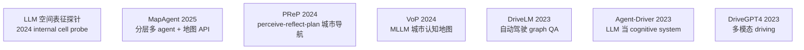
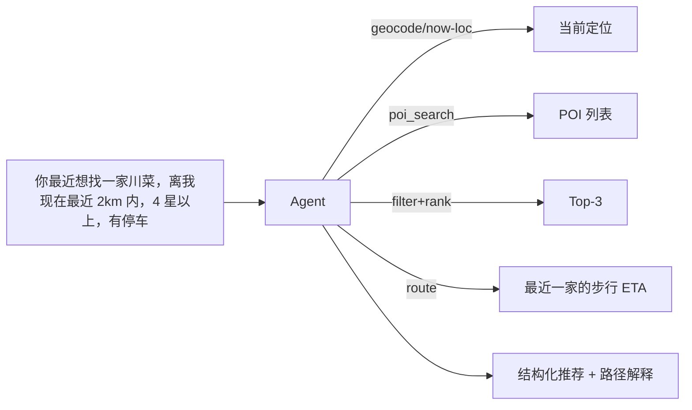
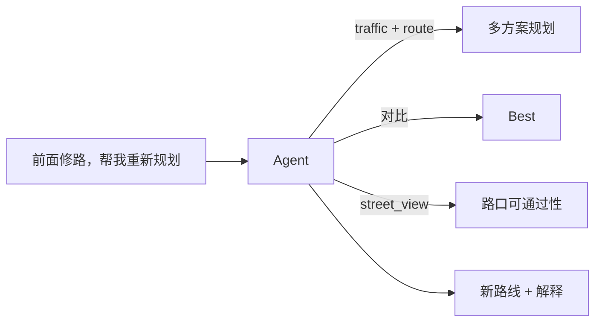

# 11 · Spatial / Map Agents 空间与地图智能体

> 学习目标：理解 SOTA 空间/地图 agent 的代表工作，掌握把传统地图/定位算子封装为 LLM 工具的工程范式，并能用真实或模拟的地图 API 搭一个最小可运行 demo。

## 1. 为什么单独一章？

地图/定位是 *天然适合 agent 化* 的业务：

- **多源工具**：路径规划 API、POI 检索、实时交通、地理编码、定位 SDK。
- **结构化输出**：经纬度 / 路径 / ETA，便于自动验证。
- **多模态需求**：用户口语 → 结构化任务；街景图 → 空间理解。
- **长程任务**：行程规划、出行助手都跨越分钟到数小时。

## 2. 必读论文

| 论文 | 一句话 |
|------|------|
| **MapAgent** (2025) | 分层多 agent，专 map-tool agent 并行调地图 API |
| **PReP** (2024) | LLaVA + 三阶段（perceive → reflect → plan）做无指令城市导航 |
| **VoP** (Verbalization of Path, 2024) | MLLM 用文本描述 + 几何属性 + 地标，模拟人类认知地图 |
| **DriveLM** (2023) | 把驾驶决策建模为 P1-P3 图问答（perception/prediction/planning） |
| **Agent-Driver** (2023) | LLM 当 driving 的 cognitive system，作为传统 stack 的高层接口 |
| **DriveGPT4** (2023) | 多模态 LLM 端到端解释驾驶动作 |
| **LLM 空间表征探针** (2024) | 探针实验：LLM 内部存在某种 city-cell 编码，类似海马体 |

详细笔记位于 [`notes/`](./notes/)。

## 3. 工具设计：把传统 pipeline 暴露给 LLM

经验法则：*把每个传统模块包装成 1 个 tool，输入输出严格 JSON*。

| 传统模块 | 暴露给 agent 的 tool | input | output |
|---------|--------------------|-------|--------|
| 地理编码 | `geocode` | address: str | {lat, lng, score} |
| 反向地理编码 | `reverse_geocode` | lat, lng | address |
| POI 搜索 | `poi_search` | keyword, near, radius | list[POI] |
| 路径规划 | `route` | origin, destination, mode | route, duration, distance |
| 实时交通 | `traffic` | bbox | congestion map |
| 定位（fusion） | `relocalize` | sensor_payload | pose, confidence |
| 地图匹配 | `map_match` | trajectory | snapped_trajectory |
| 街景 | `street_view` | lat, lng, heading | image_url |

## 4. 业务场景示例

## 5. Notebook

[`notebooks/map_agent_demo.ipynb`](./notebooks/map_agent_demo.ipynb)：
搭建一个 *离线 mock 地图 + agent* demo：
- 用 OpenStreetMap 离线数据（也提供 mock fallback，无网络也能跑）。
- 4 个工具：`geocode / poi_search / route / explain_route`。
- LLM 用 Anthropic tool use 自主调用，输出推荐 + 路径解释。
- 提示如何替换为真实高德 / 百度 / Google Maps API。

## 6. 与本仓库的衔接

- **第 03 章**（MCP）：把这一节的工具集合包装成 *MCP server* 即可在 Cursor / Claude Desktop 里直接调用。
- **第 09 章**（Agent RL）：考虑能否把「定位重定位成功率」「路径选择满意度」当 RLVR reward，做 agent post-training。
- **第 12 章**（Safety）：地图 agent 的输入会触发真实预订/导航，必须严格 HITL。
- **第 99 章**（Capstone）：项目 A 直接基于本章 notebook 扩展。

## 7. 思考与练习

详见 [exercises.md](./exercises.md)。
