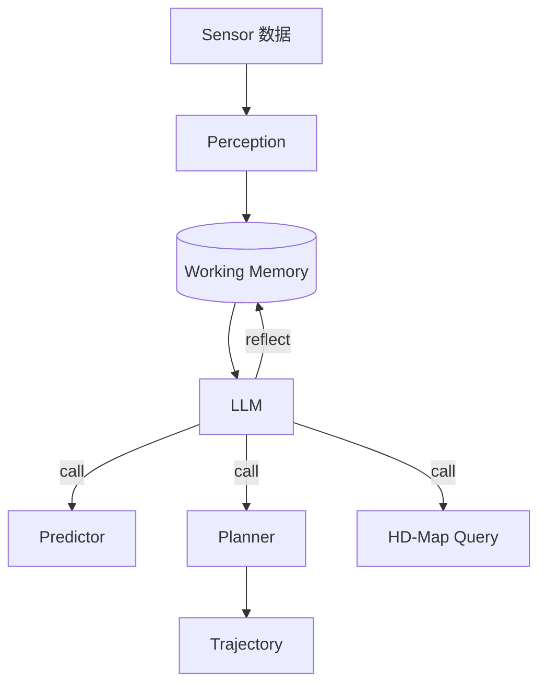

# DriveLM & Agent-Driver · 笔记

> 自动驾驶里 LLM-as-agent 的两条最有代表性的工作。
> 与地图/定位业务的关联：HD-Map / 定位 / 路径在自动驾驶 stack 里是 *基石*；agent-driver 范式可能反过来重塑 *地图数据消费方式*。

## DriveLM（2023, OpenDriveLab）

### 核心思想

把驾驶决策建模成 *graph-structured QA*：
- **P1 Perception**：「场景里有多少行人？」
- **P2 Prediction**：「左前车未来 2s 会变道吗？」
- **P3 Planning**：「我应该刹车还是变道？」
- 三层之间用 graph 连接：planning 节点必须 ground 到 perception/prediction 节点。

### 数据集

DriveLM-nuScenes / DriveLM-CARLA：人工标注的 graph QA，每个 keyframe 上百轮 QA 链。

### 意义

把端到端「图像 → 控制」的黑盒拆成 *可追溯的推理链*，便于：
- 与 HD-Map 等结构化数据 fusion
- 失败 case 归因（到底是 perception 错还是 planning 错？）
- 引入 RLHF / RLVR 做 post-training

## Agent-Driver（2023, USC）

### 核心思想

把 LLM 当作 driving system 的 *cognitive layer*，传统 stack（perception/prediction/planner）当作 *tool*，LLM 通过工具调用做高层决策。

### 关键观察

1. LLM 不直接产出控制命令，而是 *指挥* 现有模块（更安全 + 易部署）。
2. 工作记忆是关键：LLM 上下文容易丢，必须把 perception 历史存到 memory 模块。
3. 引入 reflection：当 planner 失败时 LLM 重新选 tool 或参数。

## 与地图/定位业务的概念对照

| 自动驾驶里的概念 | 地图/定位业务里的对应物 |
|------|--------|
| HD-Map 查询 | POI / 路网 / 行政区查询 |
| Perception 工具 | 定位/SLAM 算法 |
| Predictor 工具 | 轨迹预测 / ETA |
| Planner 工具 | 路径规划 |
| Reflector | agent 的 reflexion / verifier |

→ 同一套 *agent-as-cognitive-layer* 范式可以平移到 **地图业务的对话式入口**：用户用自然语言提需求，LLM 调用业务侧的算法栈完成任务。

## 关键论文

- Sima et al., *DriveLM: Driving with Graph Visual Question Answering*, ECCV 2024.
- Mao et al., *A Language Agent for Autonomous Driving*, COLM 2024.
- Xu et al., *DriveGPT4: Interpretable End-to-end Autonomous Driving via LLM*, RA-L 2024.
