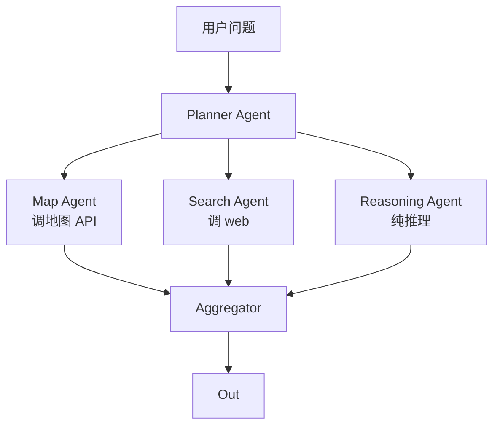

# MapAgent · 笔记

> **MapAgent: A Hierarchical Agent for Geospatial Reasoning with Map APIs**, 2025
> （选这篇是因为它直接讨论了「LLM agent 如何调地图 API」的工程范式）

## 一句话总结

把地图相关任务用 *分层多 agent* 拆解：上层 planner 输出子任务，下层多个专 agent（map agent、search agent、reasoning agent）并行调真实地图 API，最后聚合答案。

## 动机

之前的 GeoLLM / GIS-LLM 类工作用 LLM 直接回答「这两个城市谁人口多」这类问题，依赖参数化知识，幻觉严重。
MapAgent 的核心主张：**地理任务必须 grounding 到地图 API**，否则坐标、距离、行政区都是不可靠的。

## 架构

## 关键设计

1. **专项 agent 减少 prompt 复杂度**：每个 sub-agent 只暴露与自己相关的 tool schema，避免 LLM 在大量工具中选错。
2. **并行 dispatch**：planner 同时下发多任务，缩短端到端 latency。
3. **API 标准化**：地图 API 抽象成 `geocode / route / poi / boundary / elevation` 等通用接口。

## 评测

构建 ~1k 题的 *MapEval* benchmark，覆盖 POI / 路径 / 行政区 / 距离 / 海拔 / 公交。结果：MapAgent > 单 agent ReAct > 纯 LLM zero-shot。

## 工程启发

- 地图业务的常见目标是把 *定位 / 路线 / POI* 算法暴露为服务。MapAgent 的范式就是把这些服务 *再往上* 封装成 agent。
- 工程上：planner 用大模型（Claude/GPT），sub-agent 可以用小模型（Qwen/Llama）+ 自家算子，能显著降低成本。
- 未来 *MCP map server* 大概率会成为主流形态，值得提前布局。
