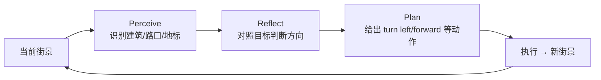

# PReP & VoP · 笔记

> **PReP**: Perceive, Reflect, Plan — 用 MLLM 做无指令的城市导航（2024）
> **VoP**: Verbalization of Path — 用语言重建多模态城市认知地图（2024）

两篇都来自 *MLLM + 城市空间* 的研究线，是与你部门最直接相关的学术工作。

## PReP：城市导航三阶段

### 任务设定

不像 R2R / Touchdown 给「向前走两个街区右转」这种指令，PReP 设定 *无指令* 任务：给定起终点（地标），让 agent 自主在街景里走过去。

### 三阶段循环

### 关键观察

1. *Reflect* 阶段是关键：不让模型直接 predict action，而是先文字化「我现在在哪 / 目标在何方」，类似 ReAct + Reflexion 的城市版。
2. MLLM 的瓶颈在 *精细方向估计*：模型能识别「目标在右前方」，但「右转 30° 还是 45°」往往不准。
3. 引入 *分层 planner*：global plan（去哪个区）+ local plan（下一步动作），缓解长程漂移。

## VoP：用语言构建认知地图

### 核心思想

人类对一个城市的认知地图不是欧式坐标网格，而是 *地标 + 路径 + 拓扑关系*（Lynch 1960）。VoP 用 MLLM 模拟这种过程：

- 输入：一段街景轨迹（图像序列）。
- 输出：自然语言描述的 path（含地标、距离感、方向感）。
- 评价：用 path 文本能否还原原始几何 → 衡量空间表征质量。

### 发现

1. MLLM 的 verbalized path *方向准确率 > 距离准确率*（人类也是）。
2. 引入显式 *geometric anchor*（如「在第三个十字路口」）能显著提升下游导航成功率。
3. 验证了 LLM 内部存在某种 *cognitive map*-like 表征——这与 2024 年 MIT 的 "Language Models Represent Space and Time" 互相印证。

## 对你部门的启发

- **POI 描述生成**：可借鉴 VoP 的「地标锚点」思路，给用户的 POI 介绍不要只说「向北 200m」而是「过两个红绿灯，星巴克斜对面」。
- **导航话术**：PReP 的 perceive-reflect-plan 可指导你们的 *AR 导航* / *口语导航* 任务的 prompt 设计。
- **多模态融合**：街景图 + GPS + IMU → 文本表征 → LLM 决策，是一条值得 PoC 的研究路径。
