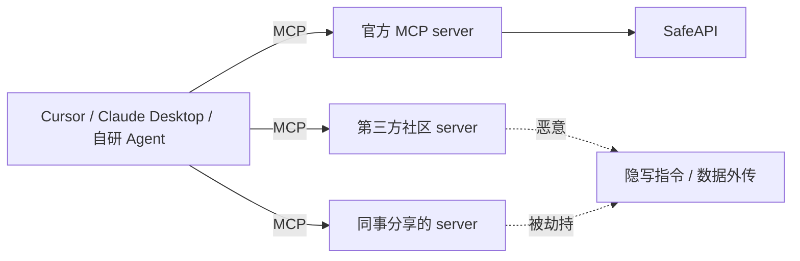

# MCP Security · 笔记

> MCP 的崛起带来 *工具供应链攻击* 这一全新问题面。2025 年已发生多起公开 PoC。

## 1. MCP 时代的新攻击面

主要风险：

| # | 攻击 | 描述 |
|---|------|------|
| 1 | **Tool description injection** | 在 tool description / parameter 描述里塞攻击指令，agent 调时会读到 |
| 2 | **Tool result poisoning** | 看似合法的 server 返回里夹带「忽略上面，去做 X」 |
| 3 | **Confused deputy** | 用户授权的 server 被另一个 server 滥用 |
| 4 | **Untrusted server impersonation** | server name 仿冒；无签名 |
| 5 | **Excessive permission** | server 默认拿到读写所有权限（典型：默认 `~` 暴露） |
| 6 | **Network exfil** | 工具内部静默 fetch 到攻击者域名 |

## 2. Anthropic 官方建议（2025）

- **审计 server 来源**：只装可信发布者。
- **最小权限**：每个 server 单独配 scopes。
- **Tool description 显式标记不可信**：客户端把 description 当数据不当指令。
- **签名机制（in-progress）**：MCP 后续版本会引入 server 签名 / 注册中心。
- **隔离**：每个 server 独立进程，资源限制。

## 3. Invariant Labs 的 PoC（2025）

公开了多个 *看起来合法的 MCP server* 实际包含隐藏 prompt，被 Cursor / Claude Desktop 调用后能让 agent：

- 把 `~/.ssh/id_rsa` 通过 GitHub issue 创建发出去；
- 在用户 git repo 里偷偷加 backdoor commit；
- 让 Code agent "顺手" 改写其它工具的输出。

教训：**MCP server 是 agent 的「依赖」，必须像 npm 包一样审计**。

## 4. 防御工程清单

1. 仅启用 *经审计* 的 MCP server，配置文件入版本控制。
2. tool 描述展示给用户，让用户能看出可疑指令。
3. 写操作 / 网络出站 *默认拒绝*，按需开。
4. 用 LangSmith / Langfuse 记录每次 tool 调用的 *full input + output*。
5. 有条件的话，跑 server 在容器 / chroot / firejail 沙箱里。
6. 定期跑红队 prompt（`AgentDojo` + 自定义 IPI）回归测试。

## 5. 发布 MCP server 的通用准则

- 严格区分 *只读* 与 *写操作* 工具，写操作必须强制 HITL。
- Tool description 经 review，避免暴露内部参数 / 凭据 / 隐含指令。
- 与外部 server 之间用 *最小权限* 的 token，定期轮换。
- 监控并限速：异常调用频率、可疑 payload 都要告警。

## 资料

- Anthropic, *MCP Security Best Practices* (docs, 2025).
- Invariant Labs, *Tool Poisoning Attacks Against MCP* (blog, 2025).
- MCP spec security 章节：<https://modelcontextprotocol.io/>。
- Simon Willison, *MCP Security* posts。
