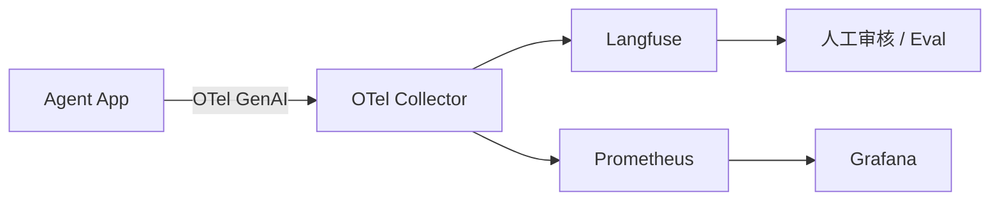

# Observability for Agents · 笔记

> 如果你只能为线上 agent 引入一件事，应是 *trace + cost + eval 三合一可观测性*。

## 1. 工业事实

2025 年公开调研显示：超过 60% 的 agent 项目失败并非模型不行，而是 *无法定位失败 trace、无法估算成本、无法回归测试*。

## 2. OpenTelemetry GenAI 语义约定

OTel 在 2024-2025 标准化了 *gen_ai.* 一系列 span 字段：

| 字段 | 描述 |
|------|------|
| `gen_ai.system` | anthropic / openai / ... |
| `gen_ai.request.model` | 模型 ID |
| `gen_ai.usage.input_tokens` / `gen_ai.usage.output_tokens` | token 用量 |
| `gen_ai.tool.name` / `gen_ai.tool.call.id` | 工具调用 |
| `gen_ai.response.finish_reasons` | stop reason |

→ 推荐：**所有自研 agent 直接发 OTel GenAI span**，避免锁定到某家 SaaS。

## 3. 主流后端对比

| 工具 | 开源 | 自托管 | 强项 | 适合 |
|------|------|--------|------|------|
| LangSmith | 否 | 否 | 与 LangChain 无缝 + Eval Studio | LangChain 重度用户 |
| Langfuse | 是 | 是 | trace + prompt mgmt + dataset eval | 自托管首选 |
| Phoenix (Arize) | 是 | 是 | RAG/embedding 可视化 | RAG 调试 |
| Helicone | 是 | 是 | API proxy 即用 | 低门槛接入 |
| Traceloop | 是 | 是 | OTel-native | 已有 OTel 栈 |
| W&B Weave | 否 | 否 | 与 W&B Sweeps 联动 | RL 研究 |

## 4. 必备四件套

1. **Trace**：完整记录 messages / tool I/O / token / latency / cost。
2. **Eval**：dataset + metric（exact-match / LLM-as-judge / 自定义）+ regression。
3. **Cost & latency dashboard**：按 user / route / model 切片。
4. **Alerting**：失败率、p95 延时、单用户成本异常告警。

## 5. 部署最小拓扑

## 6. Eval 的 Best-of 实践

- 维护 *回归数据集*（覆盖关键 happy path + 关键攻击 prompt）。
- 每次 prompt / 模型 / 工具变更，自动跑回归。
- 用 *LLM-as-Judge* 时锁定 judge 模型版本，避免 judge 漂移污染指标。
- 维护 *人类打分子集* 作为 ground truth，校准 judge。

## 7. 工具型 agent 的关键观测维度（示例）

针对「LLM + 一组业务工具」类的 agent，建议至少跟踪以下维度：

- **工具命中率**：每类工具是否成功返回有效结果。
- **决策一致率**：agent 输出与传统业务 pipeline 输出的差异比例。
- **HITL 触发率**：过高说明 agent 自主性低，过低可能漏审。
- **每对话成本**：模型 token + 外部 API 调用次数。
- **用户中断率**：用户提前关闭 / 重置对话的比例。

## 资料

- OpenTelemetry GenAI semantic conventions (OTel docs)。
- Langfuse docs <https://langfuse.com/docs>。
- LangSmith docs <https://docs.smith.langchain.com>。
- Arize Phoenix docs。
- *Galileo Agent Leaderboard* / *AgentOps* 行业报告。
