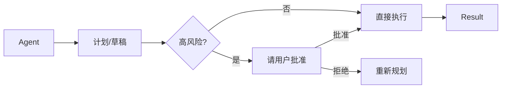

# 沙箱与 HITL · 笔记

## 1. 为什么需要沙箱

LLM Agent 可以执行任意代码 / 命令 / API 调用，且攻击面横跨多个层级：

- 代码执行 agent（CodeAct, OpenInterpreter）
- Shell / 文件系统访问
- 网络 fetch
- Computer Use 鼠标键盘

任何一处失误都可能 *永久破坏* 用户机器或泄露数据。

## 2. 沙箱方案对比

| 层级 | 方案 | 隔离强度 | 启动速度 | 典型用途 |
|------|------|---------|----------|----------|
| 进程级 | `subprocess` + ulimit | 弱 | 快 | 教学 demo |
| Linux 命名空间 | `firejail` / `bwrap` | 中 | 快 | 本地 code agent |
| 容器 | Docker / Podman | 中-强 | 中 | 大多数生产 |
| MicroVM | Firecracker / gVisor | 强 | 中 | OpenAI / Anthropic 内部 |
| 远程沙箱 | E2B / Daytona / Modal Sandboxes | 强 | 慢（启动 1-3s） | SaaS code agent |

工业级 code agent（Devin、Cursor Composer、OpenHands）大多用 *容器 + 限网络 + 临时卷*。

## 3. HITL（Human-in-the-Loop）模式

实战 6 条经验：

1. **明确「高风险」白名单**：写文件、删除、网络写、付款、改 git history、改 prod。
2. **批量批准**：连续多个低风险动作可合并展示，避免疲劳。
3. **可撤销**：实现 undo / dry-run 模式（如 git apply --check）。
4. **超时降级**：用户长时间不响应自动 fallback 到拒绝。
5. **审计日志**：每一次 ask + 用户决定都要落库。
6. **分级权限**：team-mode 下，重大操作需要 *2 人批准*。

## 4. 与 Anthropic *Building Effective Agents* 的呼应

> "Agentic systems often trade latency and cost for better task performance, and you should consider when this tradeoff makes sense. The most successful implementations also use simple, composable patterns rather than complex frameworks."

→ 一切 agent 设计的「保险丝」就是 HITL。

## 5. 与你部门的关联

地图业务里的高风险动作举例：
- 触发 *提交反馈到底图编辑系统*
- 触发 *扣费计费*
- 修改 *用户家庭地址 / 常用地址*
- 触发 *打车下单 / 酒店预订*

→ 这些动作必须走 HITL；只读类（搜索 / 路径 / ETA / 推荐）可以全自动。

## 6. 资料

- Anthropic, *Building Effective Agents* (blog).
- E2B, *Sandboxes for AI Agents* docs.
- OpenInterpreter, *safety mode* docs.
- Daytona / Modal sandboxes for code agents（2025 最常被引用）。
