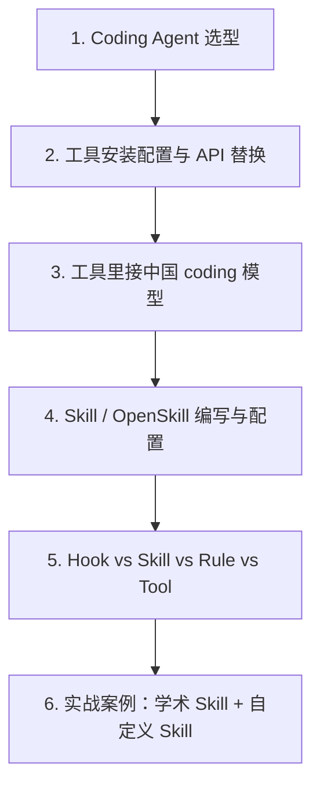

# 13 · LLM Agent 使用实战

> 本目录聚焦 **怎么选择、配置、使用 LLM Agent 工具**。前面章节偏理论、论文与框架，本目录偏实用教程：选哪个 coding agent、**在 Cursor 等工具里接中国 coding 模型**、Skill/OpenSkill 怎么写、Hook 与 Skill 有什么区别。

## 1. 本目录适合解决的问题

- 想用 Cursor / Claude Code / Codex / Aider / OpenHands 等 coding agent，但不知道选哪个。
- 想在 **Cursor、VS Code 插件、Aider** 等里用 **DeepSeek、Qwen、GLM** 等中国（或国内可调用）coding 模型。
- 想理解 Skill、OpenSkill、Hook、Rule、MCP Tool 等概念的区别。
- 想给常见工作流写可复用 skill：编码、学术代码、论文修改、Word/Excel/PPT/PDF、Git/DevOps。

## 2. 阅读顺序




## 3. 文件导览

| 文件                                                                                   | 内容                                                                                        |
| ------------------------------------------------------------------------------------ | ----------------------------------------------------------------------------------------- |
| `[notes/complete_config_tutorial.md](./notes/complete_config_tutorial.md)`           | **📘 完整安装配置教程（本文）**：工具安装 → API 替换 → Skills 配置 → 案例，零基础到上手                     |
| `[notes/coding_agent_selection.md](./notes/coding_agent_selection.md)`               | Coding Agent 选择指南：Cursor、Claude Code、Codex、Aider、OpenHands、Devin、国产工具等                    |
| `[notes/domestic_coding_models_in_ide.md](./notes/domestic_coding_models_in_ide.md)` | **在 IDE / CLI 工具里**接入中国 coding 模型：Cursor / VS Code / Aider / 工具策略与排错                            |
| `[notes/openskills_install_and_usage.md](./notes/openskills_install_and_usage.md)`   | **OpenSkills（npm CLI）**：`npx openskills install/sync`，及 `anthropics/skills` 各子 skill 功能速览 |
| `[notes/skill_openskill_guide.md](./notes/skill_openskill_guide.md)`                 | Skill / OpenSkill 的原理、**手写/迁移** 编写、配置与工具差异                                                |
| `[notes/hooks_vs_skills.md](./notes/hooks_vs_skills.md)`                             | Hook、Skill、Rule、Command、MCP Tool、Function Calling 的理解与比较                                  |
| `[examples/](./examples/)`                                                           | 可复制的 Skill / Hook / 配置片段                                                                  |

> **推荐阅读顺序**：先读 `complete_config_tutorial.md`（零基础到上手），按需查阅其他专项文档。


## 4. 快速结论

### Coding Agent 怎么选


| 场景                            | 推荐                          |
| ----------------------------- | --------------------------- |
| 日常开发、阅读项目、改中小 feature         | **Cursor**                  |
| 终端重度用户、脚本/后端项目、长上下文           | **Claude Code**             |
| OpenAI 生态、轻量 CLI coding       | **Codex CLI**               |
| 想用国产/开源模型 + git 友好            | **Aider**                   |
| 想自托管云端 agent / 做 SWE-bench 研究 | **OpenHands / SWE-agent**   |
| 想委托长任务、让 agent 自己开 PR         | **Devin / 云端 coding agent** |


### 在工具里用中国 coding 模型

在 **Cursor / VS Code 插件 / Aider** 里，通常走 **OpenAI 兼容**：填好 `api_key`、`base_url`、厂商文档里的 **model ID**（如 `deepseek-chat`）。**Claude Code / 官方 Claude 栈默认走 Anthropic**，不能简单等同为「在设置里填国产 base_url」；细节见 [`notes/domestic_coding_models_in_ide.md`](./notes/domestic_coding_models_in_ide.md)。

用脚本自测 API 是否可用时，可以用 OpenAI SDK 统一调用：

```python
from openai import OpenAI

client = OpenAI(
    api_key="YOUR_API_KEY",
    base_url="https://api.deepseek.com",
)
resp = client.chat.completions.create(
    model="deepseek-chat",
    messages=[{"role": "user", "content": "你好"}],
)
print(resp.choices[0].message.content)
```

### Skill 和 Hook 怎么理解

- **Skill**：给 agent 的「可按需加载的知识/流程说明」。
- **Hook**：在某个事件发生前后自动执行的脚本或命令。
- **Rule**：长期生效的行为约束。
- **MCP Tool**：真正可执行的外部工具。
- **Function Calling**：模型调用工具的 schema 协议。

一句话：**Skill 告诉 agent 怎么做，Hook 在事件发生时自动做，Tool 让 agent 能做。**

## 5. 与其它章节的关系

- 第 03 章讲 Tool Use / MCP 的原理，本目录讲实际工具怎么配。
- 第 07 章讲框架选型，本目录讲开发者日常怎么用。
- 第 10 章讲 frontier coding agent，本目录整理成实操教程。
- 第 12 章讲安全，本目录在每个工具使用方案里补充权限、沙箱、HITL 建议。

