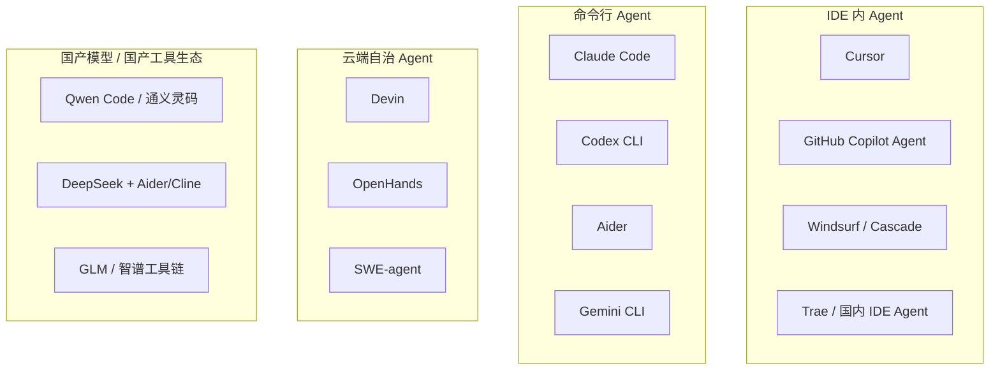
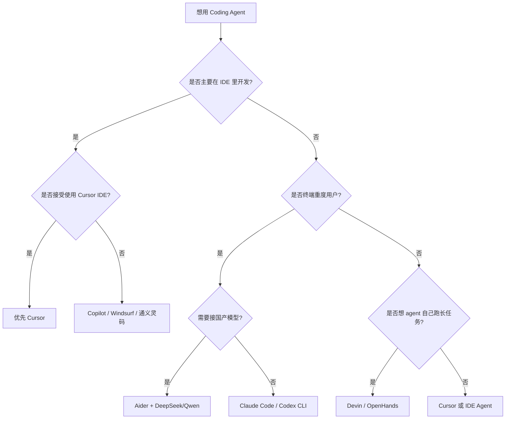
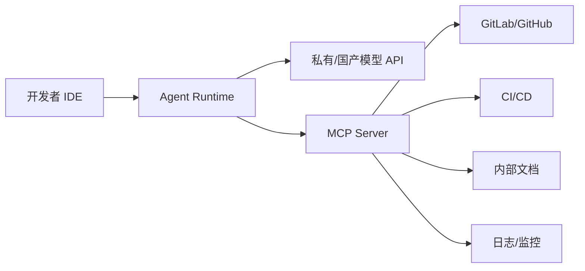

# Coding Agent 选择指南

> 目标：帮助开发者根据工作方式、模型偏好、预算、隐私要求选择合适的 coding agent 工具。

## 1. 先按形态分类



## 2. 主流工具对比

| 工具 | 形态 | 适合场景 | 优点 | 主要限制 |
|------|------|----------|------|----------|
| **Cursor** | IDE | 日常开发、读项目、跨文件修改 | 上手快、上下文感知好、diff 可控、生态活跃 | 依赖 Cursor IDE；自定义模型/工具能力受版本影响 |
| **Claude Code** | CLI | 后端/脚本/复杂项目、长上下文任务 | 终端体验强、上下文长、适合自动跑测试和修复 | 依赖 Anthropic 账号；国内网络可能不稳定 |
| **Codex CLI** | CLI | OpenAI 生态、轻量 coding agent | 与 OpenAI 模型适配好，命令行轻量 | 工具生态与长期记忆不如 IDE agent |
| **Aider** | CLI | git 驱动开发、自定义模型、低成本 | 支持多模型后端，git 集成强，可接国产模型 | UI 原始，需要会用命令行 |
| **OpenHands** | 本地/云端 | 自托管 agent、研究 SWE-bench | 开源、可控、可替换模型 | 部署和调试成本高 |
| **SWE-agent** | 研究框架 | 论文复现、benchmark、自动修 bug | ACI 清晰，适合研究自动软件工程 | 不适合日常交互开发 |
| **Devin** | 云端自治 | 长任务外包、从 issue 到 PR | 自带云端环境，自治程度高 | 成本高、透明度/可控性较弱 |
| **Windsurf / Cascade** | IDE | 类 Cursor 的日常开发 | IDE 集成自然，项目索引好 | 生态规模、模型可选项依赖版本 |
| **通义灵码 / Trae / 国产 IDE Agent** | IDE | 国内网络环境、中文场景、国产模型 | 网络低延迟、中文文档适配好 | 对复杂 agent workflow、工具调用能力需实测 |

## 3. 选择决策树



## 4. 典型使用组合

### 4.1 日常个人开发

推荐：

- 主力：**Cursor**
- 终端补充：**Claude Code / Aider**
- 模型：Claude Sonnet / GPT-4.1 / DeepSeek Chat / Qwen Coder

工作流：

1. Cursor 负责读代码、局部改动、重构。
2. 终端 agent 负责跑测试、批量脚本、依赖安装。
3. 重要改动只让 agent 生成 patch，人类 review 后 commit。

### 4.2 低成本国产模型方案

推荐：

- 工具：**Aider / Cline / Continue / Open WebUI + 自定义脚本**
- 模型：DeepSeek V3 / DeepSeek R1 / Qwen Coder / GLM
- 接入：OpenAI compatible endpoint

示例（Aider）：

```bash
export OPENAI_API_KEY=$DEEPSEEK_API_KEY
export OPENAI_API_BASE=https://api.deepseek.com

aider --model openai/deepseek-chat
```

如果工具支持 `base_url` 配置，优先用厂商的 OpenAI 兼容接口。国产模型做 coding agent 时重点测试三件事：

- **函数调用 / tool use** 是否稳定。
- **长上下文** 是否足够读项目。
- **补丁格式** 是否稳定，不要经常输出无法应用的 diff。

在 **Cursor、VS Code 插件** 里怎么填 `base_url`、以及 **Claude 官方栈为何不能直接当「换国产一样」配**，见专文：[`chinese_model_api_integration.md`](./chinese_model_api_integration.md)。

### 4.3 企业 / 团队自托管

推荐：

- IDE：Cursor / 内部 VS Code 插件
- Agent runtime：OpenHands / 自研 LangGraph agent
- 模型：Qwen Coder / DeepSeek / 私有部署模型
- 工具协议：MCP + 内部工具 server

架构：



## 5. Coding Agent 的能力边界

适合：

- 跨文件重构（接口改名、参数迁移）。
- 生成测试、修 lint、补文档。
- 阅读陌生项目并总结结构。
- 复现 bug 并提出修复 patch。
- 写脚本、数据清洗、自动化小工具。

不适合完全交给 agent：

- 高风险生产变更。
- 复杂产品决策。
- 没有测试的核心算法重写。
- 需要强一致性的数据库迁移。
- 含密钥/隐私数据的代码操作。

## 6. 使用时的基本安全规范

1. **所有自动修改都走 git diff**：不要让 agent 直接覆盖大量文件后不看 diff。
2. **限制 shell 权限**：安装依赖、删除文件、网络请求都应确认。
3. **不要把密钥放进上下文**：`.env`、凭证、用户数据不要发给模型。
4. **先小步提交**：每个独立任务一个 commit，方便回滚。
5. **让 agent 自己跑测试，但不要跳过 review**。

## 7. 推荐练习

1. 用 Cursor 读一个陌生 Python 项目，让它输出模块图。
2. 用 Claude Code / Aider 修一个 lint 错误，并观察它的 shell 命令。
3. 用 DeepSeek + Aider 完成一次小重构，对比 Claude/GPT 的 patch 质量。
4. 用 OpenHands 跑一个小 issue，观察它的 long-horizon 行为。
