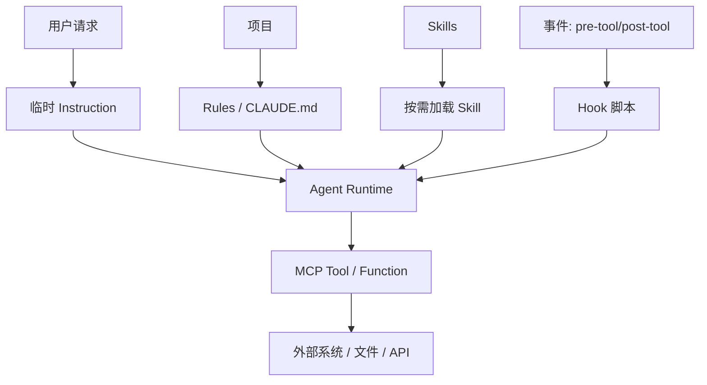
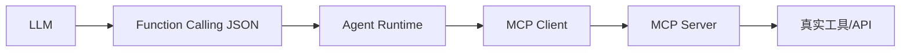
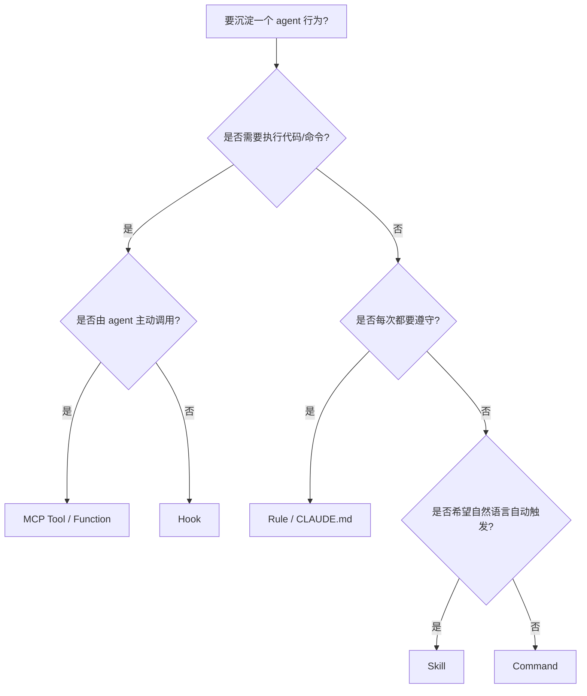

# Hook、Skill、Rule、Command、Tool 的理解与比较

> Agent 工具生态里有很多相近概念：Skill、Hook、Rule、Command、MCP Tool、Function Calling、Memory、Instruction。它们解决的是不同层级的问题。

## 1. 一句话区分


| 概念                   | 一句话                    |
| -------------------- | ---------------------- |
| **Instruction**      | 当前对话里给模型的临时指令          |
| **Rule**             | 持久、自动生效的行为约束           |
| **Skill**            | 按需加载的任务说明书             |
| **Command**          | 手动触发的固定工作流             |
| **Hook**             | 某个事件发生前后自动执行的脚本        |
| **Tool / MCP Tool**  | agent 可以调用的外部能力        |
| **Function Calling** | 模型调用工具的 JSON schema 协议 |
| **Memory**           | agent 记住的用户偏好或长期上下文    |


## 2. 总览图




## 3. Skill vs Rule


| 维度   | Skill                        | Rule             |
| ---- | ---------------------------- | ---------------- |
| 触发方式 | 按 description / 场景匹配         | 持久生效或按文件规则生效     |
| 适合内容 | 任务流程、模板、领域知识                 | 代码风格、行为边界、长期约束   |
| 例子   | `paper-polish`、`code-review` | “不要直接 push main” |
| 风险   | 太长会占上下文                      | 太多会污染所有任务        |


### 判断方法

如果这条信息 **只在某类任务中需要**，写成 Skill。

如果这条信息 **每次 agent 都必须遵守**，写成 Rule。

示例：

- “审查 PR 时必须按 Critical/Suggestion/Nit 输出” → Skill。
- “永远不要提交 `.env` 文件” → Rule。

## 4. Skill vs Hook


| 维度     | Skill        | Hook           |
| ------ | ------------ | -------------- |
| 本质     | 文本说明         | 可执行脚本          |
| 触发     | 语义匹配 / 手动指定  | 事件触发           |
| 能否读写文件 | 本身不能         | 可以             |
| 适合     | 指导 agent 如何做 | 自动检查、自动注入、自动验证 |


### 例子

Skill：

```markdown
---
name: python-style
description: Check and format Python code following project style.
---

# Python Style
- Use ruff format .
- Use ruff check .
```

Hook：

```bash
#!/usr/bin/env bash
# pre-commit hook
ruff format .
ruff check .
```

### 搭配方式

最佳实践是：**Skill 写策略，Hook 做自动化**。

例如：

- Skill：说明 code review 要看哪些点。
- Hook：每次提交前自动跑测试和 lint。

## 5. Skill vs Command


| 维度   | Skill                       | Command                   |
| ---- | --------------------------- | ------------------------- |
| 触发方式 | 自动匹配                        | 用户手动触发                    |
| 适合   | 需要 agent 自主判断的场景            | 固定入口的流程                   |
| 例子   | “用户让我润色论文时自动用 paper-polish” | `/polish-paper intro.tex` |


Command 适合「强入口」流程，例如：

- `/write-weekly-report`
- `/review-pr`
- `/run-experiment-summary`

Skill 适合「自然语言就能触发」的流程。

## 6. Skill vs Tool / MCP Tool


| 维度     | Skill   | Tool / MCP Tool |
| ------ | ------- | --------------- |
| 作用     | 提供知识和流程 | 执行动作并返回结果       |
| 输入输出   | 文本      | JSON / 结构化数据    |
| 是否有副作用 | 否       | 可能有             |
| 安全风险   | 低       | 高               |


例子：

- Skill：告诉 agent “路径规划结果需要输出 distance/duration/polyline”。
- MCP Tool：实际调用 `route(origin, destination)` 并返回路径。

## 7. Function Calling 与 MCP

Function Calling 是模型层协议：

```json
{
  "name": "route",
  "arguments": {
    "origin": "A",
    "destination": "B"
  }
}
```

MCP 是应用层工具协议：

- 负责注册工具。
- 负责工具发现。
- 负责参数 schema。
- 负责客户端与 server 通信。

关系：




## 8. Memory 与 Skill 的区别


| 维度  | Memory       | Skill            |
| --- | ------------ | ---------------- |
| 内容  | 用户偏好 / 历史上下文 | 通用任务知识           |
| 更新  | 自动或手动积累      | 手动维护             |
| 例子  | “用户喜欢中文回答”   | “论文润色 checklist” |


判断：

- “这个用户喜欢怎样的输出” → Memory。
- “所有用户做这个任务都应遵守的流程” → Skill。

## 9. 实战组合范式

### 9.1 代码审查


| 组件    | 内容                            |
| ----- | ----------------------------- |
| Rule  | 不提交 secrets；不 force push main |
| Skill | Code Review checklist         |
| Hook  | pre-commit 跑 lint/test        |
| Tool  | `git diff`、`pytest`、`ruff`    |


### 9.2 论文修改


| 组件      | 内容                            |
| ------- | ----------------------------- |
| Skill   | Paper polish / rebuttal 模板    |
| Command | `/polish-section section.tex` |
| Tool    | LaTeX 编译、PDF diff             |
| Memory  | 作者偏好的术语、写作风格                  |


### 9.3 办公文件自动化


| 组件    | 内容                                     |
| ----- | -------------------------------------- |
| Skill | Word/Excel/PPT 操作指南                    |
| Tool  | `python-docx`、`openpyxl`、`python-pptx` |
| Hook  | 输出后自动验证文件存在/可打开                        |
| Rule  | 不覆盖原始文件                                |


## 10. 选择建议




## 11. 常见误区

1. **把 Skill 写成脚本**：Skill 不能执行动作，执行动作要用 Hook 或 Tool。
2. **把所有规范都写进 Rule**：Rule 太多会污染每个任务，降低 agent 灵活性。
3. **把 Tool 文档写成 Skill 但不提供真实 Tool**：agent 知道 API 但不能调用。
4. **Command 和 Skill 混用**：固定入口用 Command，自然触发用 Skill。
5. **忽略安全边界**：Hook/Tool 有副作用，必须权限最小化。

## 12. 推荐配置组合

### Cursor 项目

```text
.cursor/
├── rules/
│   └── safety.mdc
└── skills/
    ├── code-review/
    │   └── SKILL.md
    ├── paper-polish/
    │   └── SKILL.md
    └── office-docs/
        └── SKILL.md
```

### Claude Code 项目

```text
project/
├── CLAUDE.md
└── .claude/
    ├── commands/
    │   ├── review-pr.md
    │   └── polish-paper.md
    └── hooks/
        ├── pre-tool.sh
        └── post-tool.sh
```

### 自研 Agent

```text
agent/
├── system_prompt.md      # Rule / global instruction
├── skills/               # 按需加载文本
├── tools/                # MCP / function tools
├── hooks/                # event hooks
└── memory/               # long-term memory
```

