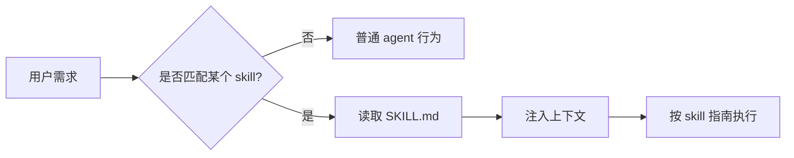

# Skill / OpenSkill 编写与配置指南

> Skill 是给 agent 的「可复用工作说明书」。它不是工具调用，而是让 agent 在合适场景下读到一段专门的流程、规范、模板或领域知识。

## 0. OpenSkills（CLI）安装与 `anthropics/skills` 各包说明

若你要用 **`npx openskills install …` + `sync` 生成 `AGENTS.md`** 这一套跨工具工作流，请直接看专文（含 `install/sync/list/read` 与各 skill 速览表）：

- **[`openskills_install_and_usage.md`](./openskills_install_and_usage.md)**

下文仍保留 **手搓 `.cursor/skills`、在 Aider/Continue 中迁移** 的通用思路。

## 1. Skill 的核心思想



Skill 解决的是三个问题：

1. **少说重复话**：不用每次都把团队规范、论文润色规则、Excel 格式要求重新告诉 agent。
2. **统一行为**：同一个任务每次输出格式一致。
3. **沉淀经验**：把一次有效的 prompt / workflow 固化成可复用资产。

## 2. Skill / OpenSkill / Rule / Hook 的位置关系

| 概念 | 作用 | 是否可执行 | 典型位置 |
|------|------|------------|----------|
| **Skill** | 按需加载的任务说明书 | 否，本质是文本 | `.cursor/skills/<name>/SKILL.md` |
| **OpenSkill** | 跨工具共享的开放 skill 规范/集合 | 通常否 | 各工具约定目录 |
| **Rule** | 长期生效的行为规则 | 否 | `.cursor/rules/*.mdc` |
| **Hook** | 事件前后自动执行脚本 | 是 | `.claude/hooks/` 或工具配置 |
| **MCP Tool** | 外部可调用工具 | 是 | MCP server |

一句话：

- **Skill** 让 agent 知道「应该怎么做」。
- **Tool** 让 agent 真的能「做某件事」。
- **Hook** 在某个事件发生时自动「触发动作」。
- **Rule** 是长期、全局或文件级「约束」。

## 3. Cursor Skill 安装方式

### 3.1 个人 Skill

适合个人长期使用：

```text
~/.cursor/skills/
└── code-review/
    └── SKILL.md
```

创建：

```bash
mkdir -p ~/.cursor/skills/code-review
```

然后写入 `SKILL.md`：

```markdown
---
name: code-review
description: Review code changes for correctness, security, and maintainability. Use when reviewing PRs or code diffs.
---

# Code Review

## Checklist
- Correctness
- Security
- Maintainability
- Tests
```

### 3.2 项目 Skill

适合跟仓库一起共享：

```text
<repo>/.cursor/skills/
└── project-style/
    └── SKILL.md
```

项目级 skill 可以提交进 git，团队成员打开仓库后都能使用。

### 3.3 不要放的位置

不要把自定义 skill 放到：

```text
~/.cursor/skills-cursor/
```

这是 Cursor 内置技能目录，系统自动管理。

## 4. OpenSkill 在不同工具中的使用

OpenSkill 可以理解为「把 Skill 写成更通用、可迁移的格式」。不同 coding agent 对 skill 的支持还不完全统一，但可以按下面方式迁移。

### 4.1 Cursor

Cursor 原生支持 `.cursor/skills/<name>/SKILL.md`：

```text
.cursor/skills/paper-polish/SKILL.md
```

特点：

- 通过 `description` 自动匹配。
- 适合流程、规范、模板。
- 最好一 skill 一任务。

### 4.2 Claude Code

Claude Code 更常用：

- `CLAUDE.md`：项目长期上下文。
- Hooks：事件驱动脚本。
- Slash command：手动触发固定流程。

迁移 Skill 的方式：

```text
project/
├── CLAUDE.md                  # 总规则
└── .claude/
    ├── commands/
    │   └── paper-polish.md    # 类似手动 skill
    └── hooks/
```

把 `SKILL.md` 的正文复制到 `.claude/commands/<name>.md`，就得到一个可手动触发的工作流。

### 4.3 Aider

Aider 没有原生 Skill，但可以用：

- `.aider.conf.yml`
- `CONVENTIONS.md`
- `--read` 参数预加载文档

示例：

```bash
aider --read CONVENTIONS.md --read SKILL_CODE_REVIEW.md
```

适合把 skill 当「项目规范文档」喂给 aider。

### 4.4 Cline / Continue / OpenHands

这类工具通常支持「Rules / Memories / Custom Instructions」。迁移方式：

- Skill 的 description → custom instruction 的触发描述。
- Skill 的正文 → rules / memory 文档。
- 如果工具支持 repository context，把 `.cursor/skills/` 目录纳入索引。

## 5. 怎么写好一个 Skill

### 5.1 好 description 的结构

```yaml
description: >-
  [做什么]. Use when [什么时候使用]. Trigger terms: [关键词].
```

示例：

```yaml
description: >-
  Polish academic paper writing for clarity, flow, and grammar.
  Use when editing paper drafts, abstracts, rebuttals, or related work sections.
```

### 5.2 SKILL.md 主体建议

```markdown
# Skill 标题

## 快速开始
1. 第一步
2. 第二步
3. 第三步

## 输出格式
[明确模板]

## 检查清单
- [ ] ...
- [ ] ...

## 常见错误
- 不要 ...
- 避免 ...
```

### 5.3 什么时候拆成多个文件

| 情况 | 做法 |
|------|------|
| 主流程很短 | 全放 `SKILL.md` |
| 有大量参考规范 | 放 `reference.md` |
| 有多个输入/输出示例 | 放 `examples.md` |
| 有固定脚本 | 放 `scripts/` |

目录示例：

```text
paper-polish/
├── SKILL.md
├── examples.md
└── reference.md
```

## 6. 常见 Skill 模板

### 6.1 Coding Review

```markdown
---
name: code-review
description: Review code changes for bugs, security, maintainability, and tests. Use when reviewing PRs or diffs.
---

# Code Review

## Review Order
1. Correctness
2. Security
3. Maintainability
4. Tests

## Output Format
- **Critical**: must fix
- **Suggestion**: consider improving
- **Nit**: optional

## Rules
- Findings first.
- Mention exact files/symbols.
- Do not summarize before listing issues.
```

### 6.2 学术代码

```markdown
---
name: academic-experiment
description: Help write and organize academic ML experiments with reproducible configs, logging, and evaluation.
---

# Academic Experiment

## Required Structure
project/
├── configs/
├── data/
├── scripts/
├── src/
└── runs/

## Checklist
- [ ] Fixed random seed
- [ ] Config separated from code
- [ ] Metrics logged to CSV / wandb / tensorboard
- [ ] Evaluation script independent from training
```

### 6.3 论文修改

```markdown
---
name: paper-polish
description: Polish academic writing for clarity, structure, grammar, and reviewer-facing style.
---

# Paper Polish

## Process
1. Check argument flow.
2. Rewrite unclear sentences.
3. Keep technical claims unchanged unless asked.
4. Preserve LaTeX commands and citations.

## Style
- Prefer concise sentences.
- Avoid hype words: novel, very, extremely.
- Keep terminology consistent.
```

### 6.4 办公软件

```markdown
---
name: office-docs
description: Create or edit Word, Excel, PowerPoint, and PDF files using Python libraries and document best practices.
---

# Office Docs

## Tool Choice
- Word: python-docx
- Excel: pandas + openpyxl
- PPT: python-pptx
- PDF text/table: pdfplumber
- PDF merge/split: pypdf

## Rules
- Never overwrite the original file.
- Save outputs with `_edited` or timestamp suffix.
- Verify generated files can be opened.
```

## 7. Skill 调试技巧

1. **先手动触发**：直接告诉 agent「使用 xxx skill」，观察输出是否符合预期。
2. **调 description**：如果 agent 不触发，通常是 description 太泛或缺触发词。
3. **减少正文冗余**：skill 太长会消耗上下文，也会降低遵循度。
4. **加负面约束**：明确「不要做什么」往往比只写「要做什么」更有效。
5. **用 examples 稳定风格**：输出质量强依赖示例。
6. **把脚本做成确定性工具**：复杂且易错的逻辑放到 `scripts/`，不要让 agent 每次临时写。

## 8. Skill 设计反模式

| 反模式 | 问题 | 改法 |
|--------|------|------|
| 一个 skill 包含所有任务 | 难触发、难遵循 | 拆成多个小 skill |
| description 太泛 | agent 不知道何时用 | 加具体触发词 |
| 正文像教程书 | 占上下文 | 只留执行步骤 |
| 没有输出格式 | 结果漂移 | 提供模板 |
| 把 tool 当 skill | skill 不能执行 | 用 MCP/tool/hook |

## 9. 推荐建设顺序

1. `code-review`：最常用，收益最大。
2. `project-style`：团队代码规范。
3. `git-workflow`：commit / PR / branch 规范。
4. `paper-polish`：论文/报告修改。
5. `academic-experiment`：实验管理。
6. `office-docs`：办公文件自动化。
