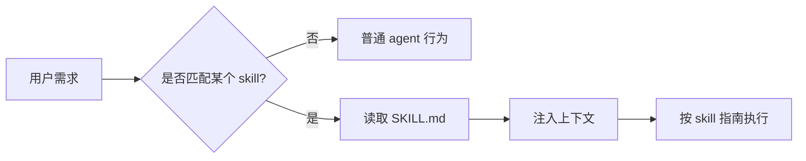

# Skills 完全指南：原理 → OpenSkills CLI → 编写 → 社区资源

> 本文是第 13 章中 **Skill 体系**的汇总文档，整合了 OpenSkills CLI 安装使用、Skill 原理与编写、社区资源三部分内容。按照「先用 → 理解 → 自己写 → 找更多」的路径组织。

---

## 目录

1. [Quick Start：一分钟上手](#1-quick-start一分钟上手)
2. [Skill 的核心思想](#2-skill-的核心思想)
3. [OpenSkills CLI 详解](#3-openskills-cli-详解)
4. [Skill 的手动安装与编写](#4-skill-的手动安装与编写)
5. [Skill 在不同工具中的迁移](#5-skill-在不同工具中的迁移)
6. [怎么写好一个 Skill](#6-怎么写好一个-skill)
7. [常见 Skill 模板](#7-常见-skill-模板)
8. [Skill 调试与反模式](#8-skill-调试与反模式)
9. [推荐建设顺序](#9-推荐建设顺序)
10. [anthropics/skills 各 Skill 速览](#10-anthropicsskills-各-skill-速览)
11. [社区科研 Skill 仓库推荐](#11-社区科研-skill-仓库推荐)

---

## 1. Quick Start

```bash
# 进入你的项目目录
cd your-project

# 从 Anthropic 官方技能仓库安装所有 skill
npx openskills install anthropics/skills

# 生成 AGENTS.md（技能索引，供 agent 自动发现）
npx openskills sync
```

装完后在 Cursor 或 Claude Code 中输入：

```
@AGENTS.md 按照 pdf skill 处理这个文件
```

---

## 2. Skill 的核心思想




Skill 是给 agent 的「可复用工作说明书」。它不是工具调用，而是让 agent 在合适场景下读到一段专门的流程、规范、模板或领域知识。

Skill 解决的是三个问题：

1. **少说重复话**：不用每次都把团队规范、论文润色规则、Excel 格式要求重新告诉 agent。
2. **统一行为**：同一个任务每次输出格式一致。
3. **沉淀经验**：把一次有效的 prompt / workflow 固化成可复用资产。

### Skill / OpenSkill / Rule / Hook / MCP 的位置关系


| 概念            | 作用                   | 是否可执行   | 典型位置                             |
| ------------- | -------------------- | ------- | -------------------------------- |
| **Skill**     | 按需加载的任务说明书           | 否，本质是文本 | `.cursor/skills/<name>/SKILL.md` |
| **OpenSkill** | 跨工具共享的开放 skill 规范/集合 | 通常否     | 各工具约定目录                          |
| **Rule**      | 长期生效的行为规则            | 否       | `.cursor/rules/*.mdc`            |
| **Hook**      | 事件前后自动执行脚本           | 是       | `.claude/hooks/` 或工具配置           |
| **MCP Tool**  | 外部可调用工具              | 是       | MCP server                       |


一句话：

- **Skill** 让 agent 知道「应该怎么做」。
- **Tool** 让 agent 真的能「做某件事」。
- **Hook** 在某个事件发生时自动「触发动作」。
- **Rule** 是长期、全局或文件级「约束」。

---

## 3. OpenSkills CLI 详解

> **OpenSkills** 指社区工具 [numman-ali/openskills](https://github.com/numman-ali/openskills)：用 `npx openskills` 从 Git 安装技能包、同步生成 `AGENTS.md`，让 **Cursor、Claude Code、Aider、Windsurf、Codex** 等能读同一份「技能注册表」。

> **易混名称**：另有 Python 包 `openskills-sdk`（另一套 Agent Skill 框架，偏 SDK/运行时），与本文的 **npm `openskills` CLI** 不是同一个项目。

### 3.1 环境要求

- **Node.js** ≥ **20.6**
- **Git**（从 GitHub 克隆/更新技能包时用）

### 3.2 安装

```bash
# 方式一：直接 npx（推荐，无需安装）
npx openskills@latest --help

# 方式二：全局安装
npm i -g openskills
openskills --help
```

### 3.3 常用命令


| 命令                                | 作用                                      |
| --------------------------------- | --------------------------------------- |
| `npx openskills install <来源>`     | 安装技能包：GitHub `org/repo`、本地路径、私有库        |
| `npx openskills sync`             | 根据已安装 skill 更新 `AGENTS.md`（或 `-o` 指定输出） |
| `npx openskills list`             | 列出已安装 skill                             |
| `npx openskills read <name>`      | 在终端输出某个 skill 内容                        |
| `npx openskills update [name...]` | 从来源更新已安装 skill（默认全部）                    |
| `npx openskills manage`           | 交互式管理（含移除）                              |
| `npx openskills remove <name>`    | 删除指定 skill                              |


**常用参数**：


| 参数                    | 含义                                |
| --------------------- | --------------------------------- |
| `--global`            | 装到用户目录 `~/.claude/skills/`（跨项目复用） |
| `--universal`         | 装到 `.agent/skills/`，多工具混用时常用      |
| `-y, --yes`           | 非交互，适合 CI                         |
| `-o, --output <path>` | 指定 `sync` 输出文件路径                  |


**多工具并存时的搜索优先级**（`--universal` 时，高优先在前）：

1. `./.agent/skills/`
2. `~/.agent/skills/`
3. `./.claude/skills/`
4. `~/.claude/skills/`

### 3.4 安装来源示例

```bash
# 从 GitHub 仓库
npx openskills install anthropics/skills
npx openskills install your-org/your-skills

# 从本地目录（自己写的 skill）
npx openskills install ./my-skill

# 从私有 Git
npx openskills install git@github.com:your-org/private-skills.git

# 多 agent 共享（universal）
npx openskills install anthropics/skills --universal
npx openskills sync
```

### 3.5 装完之后在各工具中使用

**Cursor**：确认 `.claude/skills` 或 `.agent/skills` 已存在，在对话中引用 `@AGENTS.md` 或 `@某个 SKILL.md`。

**Claude Code**：技能目录与 Anthropic 生态一致，若和官方插件装目录冲突，优先用 `--universal`。

**Aider / 其它只认文本的工具**：把 `npx openskills read <name>` 的输出附加进会话，或用 `--read` 参数预加载。

### 3.6 维护与排错


| 现象                         | 处理                            |
| -------------------------- | ----------------------------- |
| `sync` 覆盖了你改过的 `AGENTS.md` | 先 `git commit` 或改 `-o` 到备份路径  |
| 装了很多 skill 但 agent 不自动用    | 依赖各客户端实现；**显式 @ SKILL.md 最稳** |
| 私有仓库 clone 失败              | 检查 Git SSH/HTTPS、网络、权限        |
| Node 版本过低                  | 升级到 Node 20.6+                |


### 3.7 与「手写 `.cursor/skills`」的关系

- **OpenSkills 安装** → 把远程/本地的 skill 目录放到 `.claude/skills` 或 `.agent/skills`。
- **Cursor 自己放 skill** → 也是 `SKILL.md` 结构，可手工维护。
- 二者可以**并存**；`sync` 只负责**汇总成 `AGENTS.md`**，不替代你在 Cursor 里点选模型或 Rule。

---

## 4. Skill 的手动安装与编写

### 4.1 个人 Skill（全局）

```text
~/.cursor/skills/
└── code-review/
    └── SKILL.md
```

```bash
mkdir -p ~/.cursor/skills/code-review
```

写入 `SKILL.md`：

```markdown
---
name: code-review
description: Review code changes for correctness, security, and maintainability. Use when reviewing PRs or code diffs.
---

# Code Review

## Checklist
- Correctness
- Security
- Maintainability
- Tests
```

### 4.2 项目 Skill（共享给团队）

```text
<repo>/.cursor/skills/
└── project-style/
    └── SKILL.md
```

项目级 skill 可以提交进 git，团队成员打开仓库后都能使用。

### 4.3 不要放的位置

不要把自定义 skill 放到 `~/.cursor/skills-cursor/`——这是 Cursor 内置技能目录，系统自动管理。

---

## 5. Skill 在不同工具中的迁移

### 5.1 Cursor

Cursor 原生支持 `.cursor/skills/<name>/SKILL.md`，通过 `description` 自动匹配，适合流程、规范、模板。建议一 skill 一任务。

### 5.2 Claude Code

Claude Code 支持 Skills（`~/.claude/skills/`）和 Slash Commands（`~/.claude/commands/`）。

迁移方式：把 `SKILL.md` 的正文复制到 `.claude/commands/<name>.md`，就得到一个可手动触发的工作流。

### 5.3 Aider

Aider 没有原生 Skill，但可以用：

```bash
aider --read CONVENTIONS.md --read SKILL_CODE_REVIEW.md
```

### 5.4 Cline / Continue / OpenHands

Skill 的 description → custom instruction 的触发描述。Skill 的正文 → rules / memory 文档。如果工具支持 repository context，把 `.cursor/skills/` 目录纳入索引。

---

## 6. 怎么写好一个 Skill

个人不建议手写skill。利用skill-creator这个skill，向其描述清楚你的场景和需求，由agent来生成更好。

### 6.1 好 description 的结构

```yaml
description: >-
  [做什么]. Use when [什么时候使用]. Trigger terms: [关键词].
```

示例：

```yaml
description: >-
  Polish academic paper writing for clarity, flow, and grammar.
  Use when editing paper drafts, abstracts, rebuttals, or related work sections.
```

### 6.2 SKILL.md 主体建议

```markdown
# Skill 标题

## 快速开始
1. 第一步
2. 第二步
3. 第三步

## 输出格式
[明确模板]

## 检查清单
- [ ] ...
- [ ] ...

## 常见错误
- 不要 ...
- 避免 ...
```

### 6.3 什么时候拆成多个文件


| 情况         | 做法               |
| ---------- | ---------------- |
| 主流程很短      | 全放 `SKILL.md`    |
| 有大量参考规范    | 放 `reference.md` |
| 有多个输入/输出示例 | 放 `examples.md`  |
| 有固定脚本      | 放 `scripts/`     |


目录示例：

```text
paper-polish/
├── SKILL.md
├── examples.md
└── reference.md
```

---

## 7. Skill 调试与反模式

### 调试技巧

1. **先手动触发**：直接告诉 agent「使用 xxx skill」，观察输出是否符合预期。（通常的工具用/ \之类的提示之后可以选择skill）
2. **调 description**：如果 agent 不触发，通常是 description 太泛或缺触发词。
3. **减少正文冗余**：skill 太长会消耗上下文，也会降低遵循度。
4. **加负面约束**：明确「不要做什么」往往比只写「要做什么」更有效。
5. **用 examples 稳定风格**：输出质量强依赖示例。
6. **把脚本做成确定性工具**：复杂且易错的逻辑放到 `scripts/`，不要让 agent 每次临时写。

### 反模式


| 反模式             | 问题           | 改法              |
| --------------- | ------------ | --------------- |
| 一个 skill 包含所有任务 | 难触发、难遵循      | 拆成多个小 skill     |
| description 太泛  | agent 不知道何时用 | 加具体触发词          |
| 正文像教程书          | 占上下文         | 只留执行步骤          |
| 没有输出格式          | 结果漂移         | 提供模板            |
| 把 tool 当 skill  | skill 不能执行   | 用 MCP/tool/hook |


---

---

## 8. anthropics/skills 各 Skill 速览

以下对应 [github.com/anthropics/skills](https://github.com/anthropics/skills) 中 `skills/<name>/` 目录。


| 目录名                       | 功能一句话                                        |
| ------------------------- | -------------------------------------------- |
| **algorithmic-art**       | 用 p5.js 做生成式/算法艺术（种子随机、可交互参数）                |
| **brand-guidelines**      | 按 Anthropic 品牌色板与字体统一视觉风格                    |
| **canvas-design**         | 用设计流程产出 .png/PDF 等静态视觉作品                     |
| **claude-api**            | Anthropic/Claude API 应用：SDK、缓存、工具调用          |
| **doc-coauthoring**       | 协作文档工作流：收集上下文、迭代大纲与段落                        |
| **docx**                  | Word（.docx）创建/编辑：目录、样式、页眉页脚                  |
| **frontend-design**       | 前端界面设计：产品级 UI                                |
| **internal-comms**        | 内部沟通文案：状态汇报、FAQ、事故通报                         |
| **mcp-builder**           | 编写 MCP Server 的工程指南                          |
| **pdf**                   | PDF 读、拆、合、转文字/表格、OCR                         |
| **pptx**                  | PowerPoint（.pptx）创建/编辑/版式                    |
| **skill-creator**         | 设计、评估、优化 Agent Skill 本身                      |
| **slack-gif-creator**     | Slack 尺寸/时长的动图 GIF 制作                        |
| **theme-factory**         | 为 deck/文档/网页生成可复用主题                          |
| **web-artifacts-builder** | React + Tailwind + shadcn/ui 构建 Web artifact |
| **webapp-testing**        | Playwright Web 应用交互/截图/回归测试                  |
| **xlsx**                  | 电子表格读写、公式、表、图、数据清洗                           |


---

## 9. 社区科研 Skill 仓库推荐

> 以下 GitHub 上专注于 **科研 / 学术 / 论文** 的高质量 Skill 包，可直接通过 `npx openskills install <来源>` 安装。
>
> （我还没有仔细尝试过哪个效果更好）

### 综合型科研技能库


| 仓库                                                                                                    | 规模          | 一句话                           |
| ----------------------------------------------------------------------------------------------------- | ----------- | ----------------------------- |
| [K-Dense-AI/scientific-agent-skills](https://github.com/K-Dense-AI/scientific-agent-skills)           | 133 个 skill | 涵盖数据分析、文献综述、科学写作、生物信息等        |
| [LeonChaoX/qinyan-academic-skills](https://github.com/LeonChaoX/qinyan-academic-skills)               | 181 个 skill | 沁言学术科研——论文检索、深度分析、润色改写等 18 分类 |
| [Orchestra-Research/AI-Research-SKILLs](https://github.com/Orchestra-Research/AI-Research-SKILLs)     | 87 个 skill  | AI 研究工程技能：模型架构、实验管理、ML 论文写作   |
| [InternScience/Awesome-Scientific-Skills](https://github.com/InternScience/Awesome-Scientific-Skills) | 精选合集        | 开放的科学 Skill 集合，按数据清洗、可视化等分类   |


### 论文写作专项


| 仓库                                                                                                      | 特点                                                    |
| ------------------------------------------------------------------------------------------------------- | ----------------------------------------------------- |
| [Imbad0202/academic-research-skills](https://github.com/Imbad0202/academic-research-skills)             | 全流程：Research→Write→Review→Revise→Finalize，含 12 代理写作系统 |
| [Master-cai/Research-Paper-Writing-Skills](https://github.com/Master-cai/Research-Paper-Writing-Skills) | ML/CV/NLP 论文段落优化、逻辑检查、审稿人视角自评                         |
| [lishix520/academic-paper-skills](https://github.com/lishix520/academic-paper-skills)                   | Strategist（规划）+ Composer（写作）双框架                       |
| [fuhaoda/stats-paper-writing-agent-skills](https://github.com/fuhaoda/stats-paper-writing-agent-skills) | 统计学论文写作，LaTeX 前言草拟、稿件审计                               |


### 实证研究 / 跨学科


| 仓库                                                                                                                                                  | 规模                      | 特点                                |
| --------------------------------------------------------------------------------------------------------------------------------------------------- | ----------------------- | --------------------------------- |
| [brycewang-stanford/Awesome-Agent-Skills-for-Empirical-Research](https://github.com/brycewang-stanford/Awesome-Agent-Skills-for-Empirical-Research) | 119 仓库 / 23,000+ skills | 最大实证研究 Skill 聚合库，Stanford REAP 维护 |


### 其他

- [VoltAgent/awesome-agent-skills](https://github.com/VoltAgent/awesome-agent-skills) — 1000+ agent skills 聚合集合
- [paper-writing-agent](https://github.com/topics/paper-writing-agent) — GitHub Topic 聚合页

---

## 延伸阅读

- [Agent Skills 标准与规范](https://github.com/anthropics/skills)（`spec/`、`agentskills.io`）
- [OpenSkills CLI 仓库](https://github.com/numman-ali/openskills)
- 本仓库同目录：`[hooks_vs_skills.md](./hooks_vs_skills.md)`（概念辨析）、`[complete_config_tutorial.md](./complete_config_tutorial.md)`（完整教程案例）
- 实战案例：`[examples/literature-tracker](../examples/literature-tracker/SKILL.md)`（本仓库自带的完整 Skill 示例）

