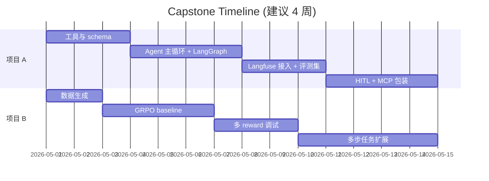

# 99 · Capstone · 综合项目

> 把前 12 章的内容串起来，做两个端到端的小项目，覆盖「业务应用」与「研究复现」两条线。

## 项目 A · 地图定位 Agent（业务向）

**目标**：把第 11 章的 demo 升级为一个 *可演示、可评测、可观测* 的小型生产级 agent。

- 真实/半真实地图工具（高德 API 或 OSM）。
- LangGraph 多步规划 + tool use。
- HITL 闸门（高风险动作）。
- Langfuse trace + 自建 100 题评测集。
- MCP server 包装，可在 Cursor 直接调用。

入口：[`project_a_map_agent/`](./project_a_map_agent/)

## 项目 B · 最小 Agent RL 复现（前沿向）

**目标**：在 *小模型 + 小数据* 上跑通 GRPO + RLVR，体会 Agent RL 训练全流程。

- Qwen2.5-0.5B-Instruct base。
- 自构造 1k 道格式严格数学题。
- TRL GRPOTrainer + 双 reward（correct + format）。
- 训练前 / 后对比；token 用量与成功率曲线。
- 进阶：扩展到多步 tool use 任务（接 SkyRL-Agent / veRL）。

入口：[`project_b_grpo_min/`](./project_b_grpo_min/)

## 项目里程碑

## 项目 A 一句话总结

把传统地图算子（geocode/poi/route）暴露成工具，用 LangGraph 实现 plan-execute-reflect 主循环；高风险动作走 HITL；用 Langfuse 做 trace、自建 100 题评测集回归；整套工具集再包成 MCP server，可在 Cursor 直接调用。

## 项目 B 一句话总结

用 Qwen2.5-0.5B + TRL GRPO 复现 RLVR 范式：1k 道带格式约束的算术题，双 reward（答案正确 + 格式合规）。训练若干步后，格式合规率与答案准确率均显著提升，验证小模型同样能从可验证奖励中受益。下一步可扩展到多步 tool use 任务（接 SkyRL-Agent / veRL）。
