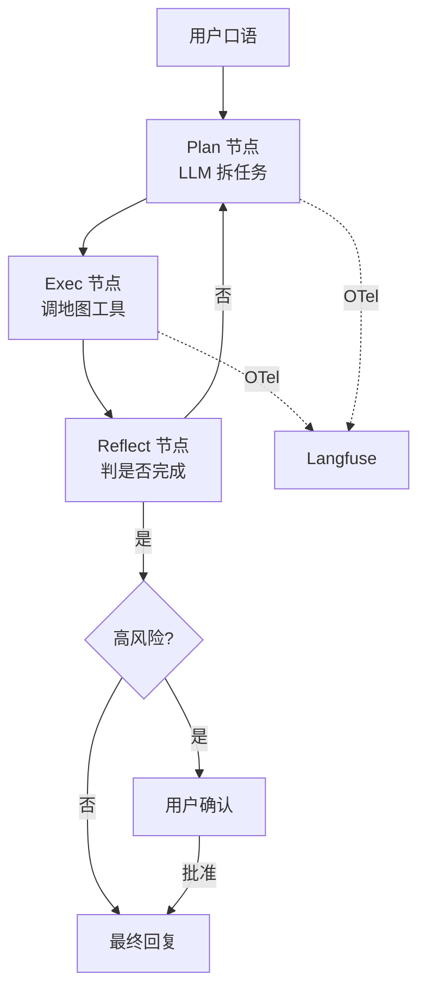

# 项目 A · 地图定位 Agent

## 1. 目标

把第 11 章的 mock demo 升级为可演示、可评测的小型生产级 agent，覆盖：

- ✅ 真实/半真实地图工具（高德 / OSM）
- ✅ LangGraph plan-execute-reflect 主循环
- ✅ HITL 闸门（写操作）
- ✅ Langfuse trace + 自建评测集
- ✅ MCP server 包装

## 2. 架构



## 3. 文件骨架

```
project_a_map_agent/
├── README.md            # 本文
├── pyproject.toml       # 依赖与脚本
├── app/
│   ├── tools.py         # 地图工具（geocode/poi/route/explain/report）
│   ├── graph.py         # LangGraph 主图
│   ├── hitl.py          # 高风险动作的 ask-confirm
│   ├── mcp_server.py    # 把 tools.py 暴露为 MCP server
│   └── main.py          # CLI 入口
├── eval/
│   ├── dataset.jsonl    # 100 题评测集（自建）
│   └── run_eval.py      # 评测 runner
└── tests/
    └── test_tools.py
```

> 当前仓库只放 `app/tools.py` 与 `app/mcp_server.py` 的最小骨架（见同目录 `app/`），
> 其余 LangGraph / HITL / eval 由你按 `01-12` 章学到的范式补齐，是 *最佳的综合复习练习*。

## 4. 阶段任务清单

- [ ] **W1**：迁移第 11 章 mock 工具到真实高德 API（注意 GCJ02 ↔ WGS84）。
- [ ] **W2**：用 LangGraph 重写主循环，引入显式 plan / exec / reflect 节点。
- [ ] **W3**：接入 Langfuse；构造 100 题评测集；用 LLM-as-judge 跑 baseline。
- [ ] **W4**：加 HITL；用 `mcp.server` 包装；在 Cursor 试用。

## 5. 关键评测指标

| 指标 | 说明 | 目标 |
|------|------|------|
| Tool hit rate | 工具调用是否找到结果 | ≥ 95% |
| Final answer EM | 推荐 POI / 路径与 ground truth 重合 | ≥ 85% |
| HITL 触发率 | 高风险动作触发 HITL 的占比 | 100% |
| 平均成本 | 每对话 token + API 费 | < $0.02 |
| p95 延时 | 用户感受到的端到端延时 | < 6 s |

## 6. 综合演练价值

- 把 LLM 与传统地图算子融合，验证「自然语言 → 工具调用 → 结构化结果」的完整链路。
- 涉及第 03 / 06 / 07 / 11 / 12 章的核心内容，是仓库知识的端到端综合应用。
